## 1. Idea general de la unidad

La unidad explica los servicios de red que intervienen al desplegar y verificar una aplicación web. Se centra en dos servicios principales:

- **DNS**, encargado de relacionar nombres de dominio con direcciones IP.
- **LDAP**, encargado de gestionar usuarios, grupos, permisos e identidades de forma centralizada.

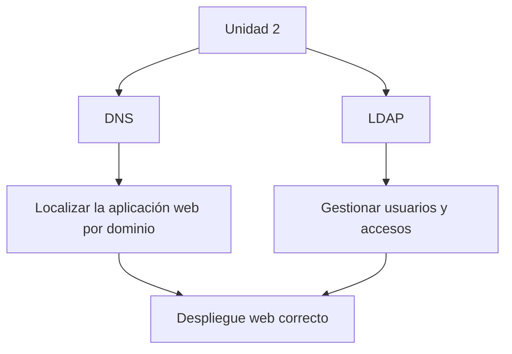

---

## 2. Servicio DNS

El **DNS** (*Domain Name System*) permite traducir nombres fáciles de recordar, como `www.ejemplo.com`, en direcciones IP que entienden los equipos de red.

### Conceptos clave

- Evita que el usuario tenga que recordar direcciones IP.
- Permite acceder a servicios mediante nombres de dominio.
- Funciona sobre el puerto **53**.
- Usa principalmente **UDP**, aunque también puede usar **TCP**.
- Trabaja con **IPv4** e **IPv6**.

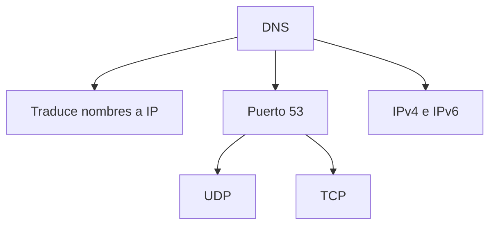

---

## 3. Funcionamiento básico de DNS

Cuando un usuario introduce un dominio en el navegador, el sistema intenta averiguar qué IP corresponde a ese dominio.

### Proceso simplificado

1. El usuario escribe un dominio en el navegador.
2. El equipo comprueba si tiene la respuesta en caché.
3. Si no la tiene, consulta a un resolver DNS.
4. El resolver consulta a otros servidores DNS.
5. Se obtiene la IP del servidor web.
6. El navegador solicita la página al servidor correspondiente.

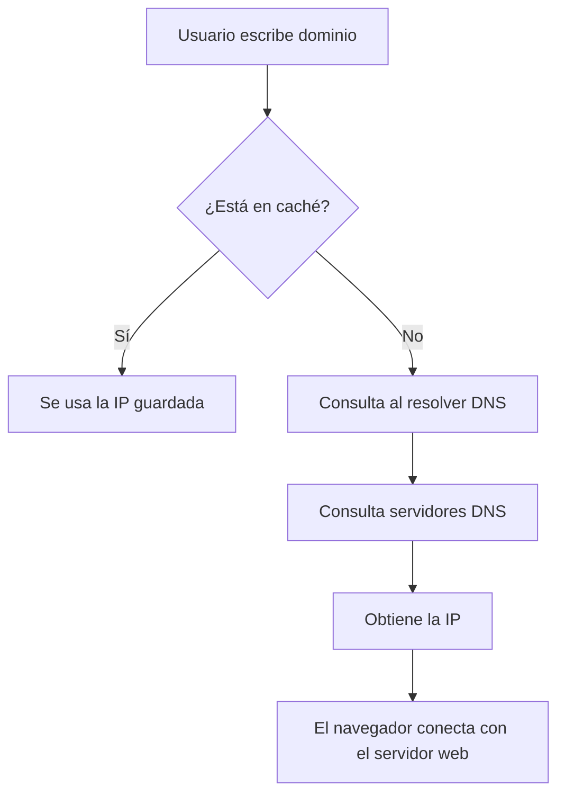

---

## 4. Jerarquía DNS

DNS se organiza como un árbol jerárquico. En la parte superior está la raíz, después los dominios de nivel superior, los dominios principales, los subdominios y finalmente los hosts o servicios.

### Niveles principales

- **Raíz**: representada por `.`
- **TLD**: dominio de nivel superior, como `.com`, `.es`, `.org`
- **Dominio de segundo nivel**: por ejemplo, `ejemplo.com`
- **Subdominio o servicio**: por ejemplo, `www.ejemplo.com`
- **FQDN**: nombre de dominio completamente cualificado.

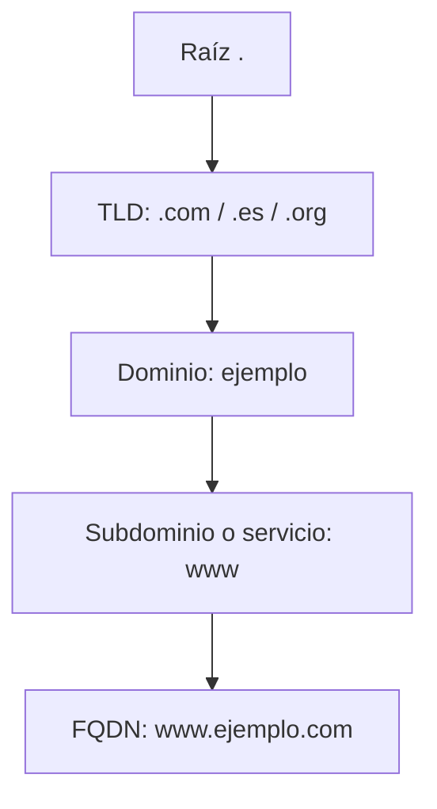

---

## 5. Tipos de servidores DNS

Los servidores DNS pueden cumplir distintos roles según la información que almacenan o cómo resuelven las consultas.

### Servidores principales

- **Primario o master**: contiene la zona principal y permite modificar registros.
- **Secundario o slave**: copia la zona del servidor primario y funciona como respaldo.
- **Reenviador o forwarder**: recibe consultas y las reenvía a otros DNS externos.
- **Caché**: almacena respuestas anteriores para acelerar futuras consultas.

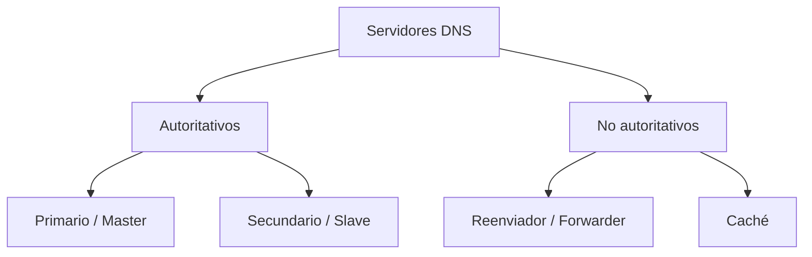

---

## 6. Zonas DNS

Una **zona DNS** es una parte del espacio de nombres DNS administrada desde uno o varios servidores DNS. Contiene los registros que indican cómo debe resolverse un dominio o subdominio.

### Ideas importantes

- Una zona no siempre equivale a un único dominio.
- Puede incluir subdominios.
- Puede delegar parte de su administración a otra zona.
- Se almacena normalmente en un archivo de zona.
- El archivo de zona contiene registros de recursos.

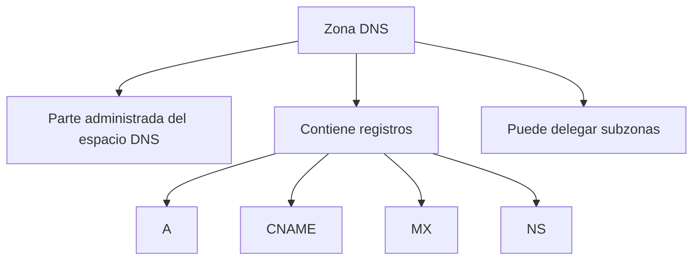

---

## 7. Transferencia de zona

La **transferencia de zona** permite que un servidor secundario copie la información de una zona desde el servidor primario.

### Características

- Se realiza entre servidores autoritativos.
- La inicia el servidor secundario.
- El primario comprueba si el secundario está autorizado.
- Permite mantener sincronizados varios servidores DNS.

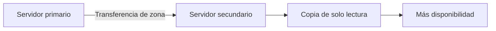

---

## 8. Consultas DNS

Las consultas DNS son las peticiones que se realizan para resolver nombres de dominio.

### Tipos de consultas

- **Recursiva**: el cliente espera una respuesta definitiva.
- **Iterativa**: el servidor responde con lo que sabe o indica otro servidor al que consultar.

### Otros conceptos relacionados

- **Delegación**: una zona apunta a otra zona inferior.
- **Reenvío**: un servidor DNS envía la consulta a otro servidor externo.
- **Resolver**: componente del cliente que realiza consultas DNS y guarda respuestas en caché.

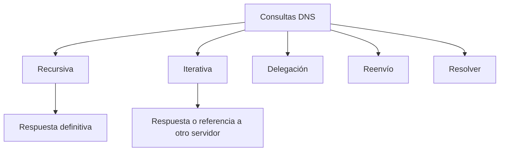

---

## 9. Resolución directa e inversa

DNS puede resolver nombres en dos sentidos.

### Resolución directa

Obtiene una dirección IP a partir de un nombre de dominio.

```text
www.ejemplo.com → 192.0.2.44
```

### Resolución inversa

Obtiene un nombre de dominio a partir de una dirección IP.

```text
192.0.2.44 → www.ejemplo.com
```

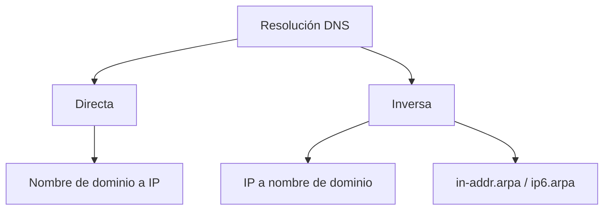

---

## 10. Registros DNS principales

Los registros DNS son entradas dentro de una zona que indican cómo se debe resolver un dominio o servicio.

| Registro | Función principal |
|---|---|
| **SOA** | Indica el inicio de autoridad de la zona. |
| **NS** | Define los servidores DNS de la zona. |
| **A** | Asocia un nombre con una dirección IPv4. |
| **AAAA** | Asocia un nombre con una dirección IPv6. |
| **CNAME** | Crea un alias hacia otro nombre. |
| **MX** | Define los servidores de correo del dominio. |
| **TXT** | Guarda texto o validaciones. |
| **PTR** | Se usa en resolución inversa. |
| **SRV** | Define servicios, protocolos, puertos y servidores. |

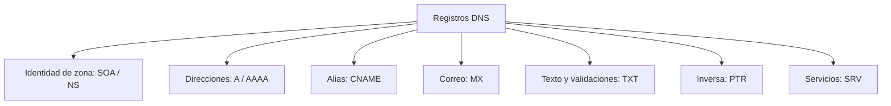

---

## 11. DNS en el despliegue de una aplicación web

Para desplegar una aplicación web, DNS permite que el dominio apunte al servidor donde se ejecuta la aplicación.

### Flujo habitual

1. Comprar un dominio.
2. Configurar los nameservers del proveedor DNS.
3. Crear registros DNS.
4. Apuntar el dominio a la IP del servidor.
5. Configurar el servidor web, como Apache o Nginx.
6. Añadir certificado SSL/TLS.
7. Esperar la propagación DNS.

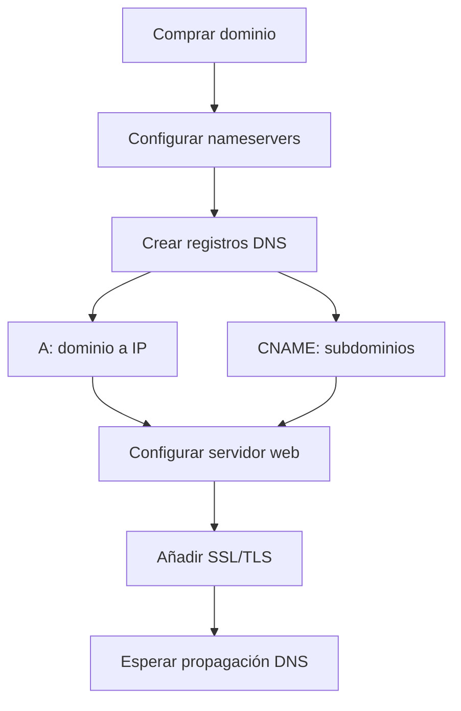

---

## 12. Servicio LDAP

**LDAP** (*Lightweight Directory Access Protocol*) es un protocolo que permite acceder, consultar y administrar servicios de directorio. Se utiliza para gestionar usuarios, grupos, equipos y otros recursos de red.

### Ideas principales

- Centraliza la gestión de identidades.
- Permite autenticar usuarios.
- Permite gestionar permisos mediante grupos o roles.
- Puede implementarse mediante **OpenLDAP**.
- No sirve para desplegar código ni servir páginas web.

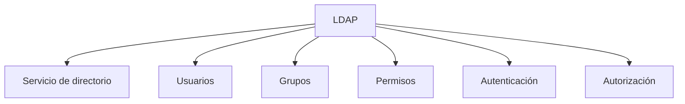

---

## 13. Modelos de LDAP

LDAP se organiza mediante varios modelos que explican cómo se representa, nombra, consulta y protege la información.

### Modelos principales

- **Modelo de información**: define entradas, atributos y objectClass.
- **Modelo de referencia**: organiza las entradas en un árbol jerárquico.
- **Modelo funcional**: define operaciones como buscar, añadir, modificar o eliminar.
- **Modelo de seguridad**: gestiona autenticación, cifrado y permisos.

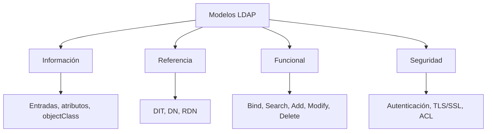

---

## 14. Conceptos básicos de LDAP

LDAP organiza la información en forma de árbol. Cada elemento del árbol es una entrada identificada por un nombre único.

| Concepto | Significado |
|---|---|
| **Entrada** | Objeto almacenado en el directorio, como un usuario o grupo. |
| **Atributo** | Dato asociado a una entrada, como `cn`, `mail` o `uid`. |
| **objectClass** | Plantilla que define qué atributos puede o debe tener una entrada. |
| **DN** | Nombre completo y único de una entrada. |
| **RDN** | Nombre relativo de una entrada dentro de su nivel. |
| **DIT** | Árbol jerárquico donde se organizan las entradas LDAP. |

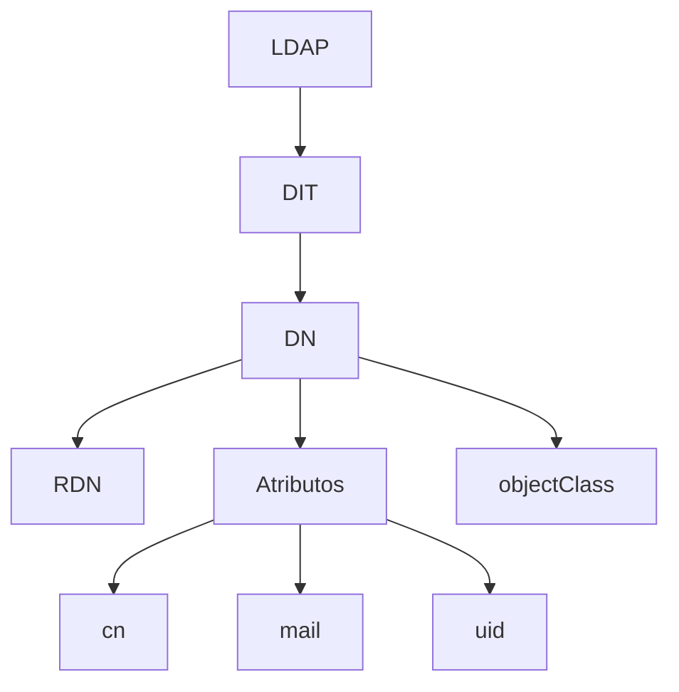

---

## 15. Archivos LDIF

Los archivos **LDIF** son archivos de texto plano usados para representar o importar entradas en un directorio LDAP.

### Características

- Tienen extensión `.ldif`.
- Contienen entradas LDAP.
- Cada entrada empieza por un `dn`.
- Después se indican sus atributos.
- Se pueden usar para crear, modificar o importar datos.

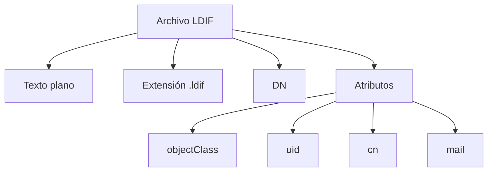

Ejemplo simplificado:

```ldif
dn: uid=fernando,ou=empleados,dc=prueba,dc=com
objectClass: inetOrgPerson
uid: fernando
cn: Fernando
sn: Vázquez
mail: fvazquez@prueba.com
```

---

## 16. LDAP en una aplicación web

En una aplicación web, LDAP suele utilizarse para autenticar y autorizar usuarios. La aplicación no necesita guardar todas las contraseñas en su propia base de datos, sino que consulta al servidor LDAP.

### Flujo básico

1. El usuario introduce usuario y contraseña.
2. La aplicación recibe las credenciales.
3. La aplicación consulta al servidor LDAP.
4. LDAP confirma si el usuario es válido.
5. LDAP puede devolver grupos o roles.
6. La aplicación concede o deniega el acceso.

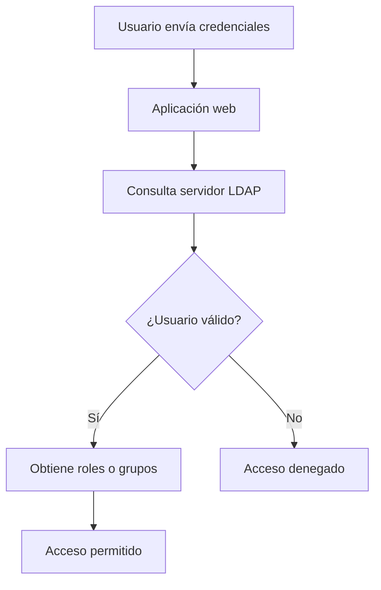

---

## 17. Comparativa DNS y LDAP

| Servicio | Función principal | Relación con una aplicación web |
|---|---|---|
| **DNS** | Traduce dominios a IP. | Permite acceder a la aplicación mediante un dominio. |
| **LDAP** | Gestiona usuarios, grupos y permisos. | Permite autenticar y autorizar usuarios. |

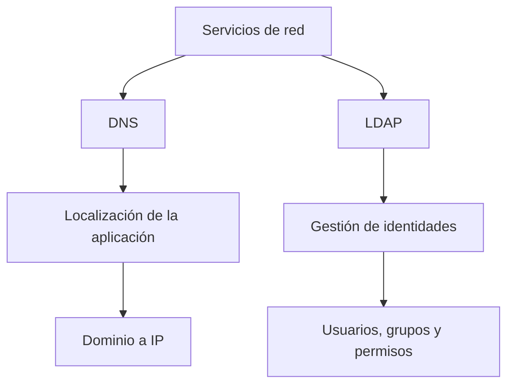

---

## 18. Resumen final

La unidad muestra que desplegar una aplicación web no consiste solo en subir código a un servidor. También es necesario configurar correctamente los servicios de red implicados.

- **DNS** permite que el usuario acceda mediante un dominio.
- **Los registros DNS** conectan el dominio con servidores y servicios concretos.
- **Las zonas DNS** permiten administrar partes del espacio de nombres.
- **LDAP** permite gestionar usuarios y permisos de forma centralizada.
- **SSL/TLS** protege la comunicación entre cliente y servidor.
- La verificación del despliegue consiste en comprobar que estos servicios están bien configurados.

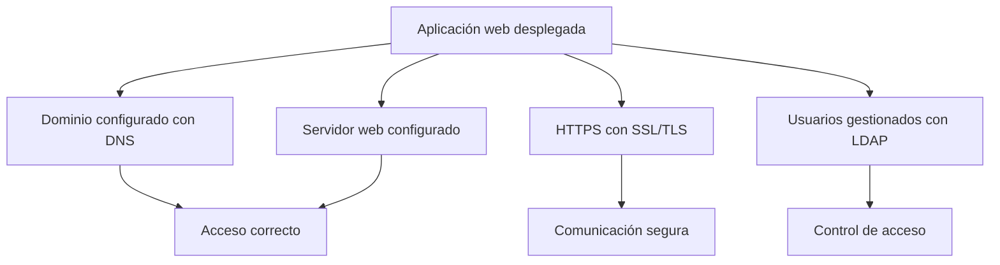
