import BorderedSection from '../../../../components/bordered-section.astro';

> «No encuentres clientes para tus productos, encuentra productos para tus clientes»  
> — Seth Godin

## Sumario

1. [El mercado](#1-el-mercado)
   - [1.1. Tamaño y cuota de mercado](#11-tamaño-y-cuota-de-mercado)
   - [1.2. Estructura del mercado](#12-estructura-del-mercado)
   - [1.3. Tipos de mercado](#13-tipos-de-mercado)
2. [Segmentación del mercado](#2-segmentación-del-mercado)
   - [2.1. Criterios para segmentar y tipos de estrategias](#21-criterios-para-segmentar-y-tipos-de-estrategias)
3. [El marketing](#3-el-marketing)
   - [3.1. Producto](#31-producto)
   - [3.2. Precio](#32-precio)
   - [3.3. Promoción](#33-promoción)
   - [3.4. Place / Distribución](#34-place--distribución)
4. [La atención al cliente](#4-la-atención-al-cliente)

## Objetivos

- Distinguir y conocer los distintos tipos de mercado.
- Conocer y manejar distintas estrategias para segmentar mercados.
- Valorar el marketing como una herramienta para buscar clientes y satisfacer sus necesidades.
- Conocer el funcionamiento del mercado.
- Diseñar estrategias de marketing mix en cuanto a producto, precio, distribución y comunicación.
- Conocer y valorar la importancia de las técnicas de atención al cliente.
- Resaltar la importancia de las redes sociales a nivel de marketing online.

---

## 1. El mercado

El mercado es el lugar físico o virtual, por ejemplo Internet, en el que los compradores y vendedores realizan transacciones de bienes o servicios.

El concepto de mercado está muy relacionado con las leyes de la oferta y la demanda:

- **Oferta:** cantidad de un bien o servicio que el vendedor pone a la venta. Si la oferta es mayor que la demanda, bajará el precio.
- **Demanda:** cantidad de un bien o servicio que la gente desea adquirir. Si la demanda es mayor que la oferta, subirá el precio.

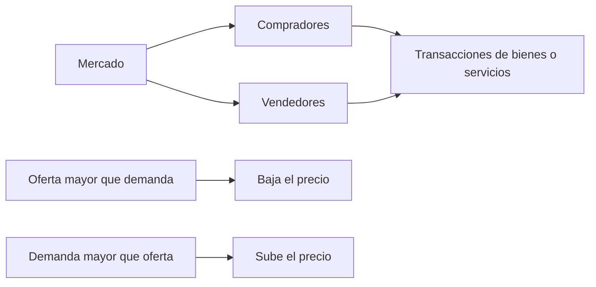

---

### 1.1. Tamaño y cuota de mercado

- **Tamaño de mercado:** total de unidades vendidas en un determinado período y en un ámbito geográfico concreto.
- **Cuota de mercado:** participación o porcentaje en el total de ventas que tienen las empresas que comercializan el mismo producto.

:::note[Fórmula de cuota de mercado]
Cuota de mercado = (Total ventas de una empresa x 100) / Total ventas del sector
:::

Del resultado obtenido debemos extraer las siguientes conclusiones:

- La cuota de mercado indica qué empresa se posiciona en primer lugar teniendo en cuenta la variable **número de ventas**.
- Mayor cuota de mercado no siempre significa mayor beneficio económico.

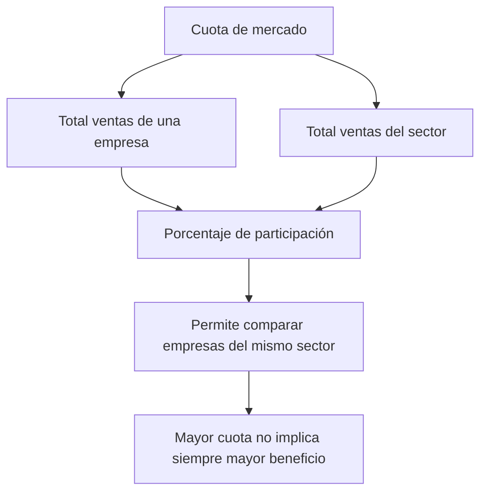

---

### 1.2. Estructura del mercado

La estructura de cualquier mercado viene determinada por dos variables que condicionan su funcionamiento:

1. **El número de empresas** que producen los mismos productos o prestan los mismos servicios.
2. **El número de compradores o clientes** que están dispuestos a adquirir los productos o utilizar los servicios.

En base a esos dos criterios podemos hablar de:

- **Competencia perfecta:** existen muchos compradores y vendedores, de manera que ninguno puede influir en el precio del producto.
- **Competencia imperfecta:** un agente o unos pocos controlan el producto, influyendo en el precio.

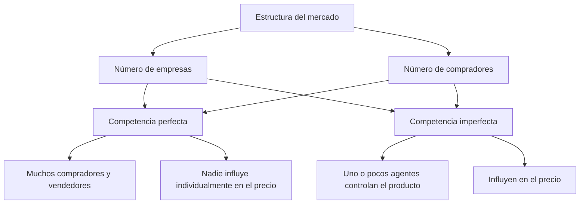

### Tipos de competencia imperfecta

| Tipo | Descripción | Ejemplo |
|---|---|---|
| **Monopsonio** | Un solo comprador. | Industria de armamento: el Estado es el único demandante de este tipo de productos. |
| **Oligopsonio** | Unos pocos compradores. | Industria del cacao: tres empresas compran casi toda la producción a nivel mundial. |
| **Monopolio** | Un solo vendedor controla el mercado de un determinado producto. | Una empresa controla la oferta de un producto. |
| **Oligopolio** | Unos pocos vendedores controlan el mercado de un determinado producto. | Compañías eléctricas como Iberdrola o Endesa; distribuidoras de combustible como Repsol, Campsa o Petronor. |
| **Duopolio** | Solo hay dos oferentes frente a muchos demandantes. | Coca-Cola y Pepsi Cola. |
| **Competencia monopolística** | También llamada mercado competitivo. Existen muchas empresas que ofrecen el mismo producto, pero tratan de marcar la diferencia mediante calidad, marca, servicio, etc. | Vehículos de alta gama. |

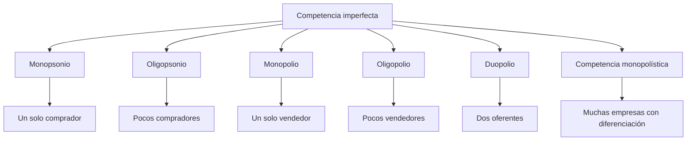

> **Clic@**  
> La [Comisión Nacional de los Mercados y la Competencia (CNMC)](http://www.cnmc.es/) regula todos los sectores productivos con el fin de proteger a los consumidores.

---

### 1.3. Tipos de mercado

| Tipo de mercado | Descripción | Ejemplos |
|---|---|---|
| **Bienes perecederos** | Se agotan en un período concreto de tiempo. | Alimentos, combustibles, etc. |
| **Bienes duraderos** | Permiten un uso prolongado. | Automóviles, ropa, electrodomésticos, etc. |
| **Bienes industriales** | Se utilizan para producir otros bienes. | Productos agrícolas, productos de origen extractivo como el petróleo, etc. |
| **De servicio** | Tienen una naturaleza intangible y no se fabrican, sino que se prestan. | Sanidad, educación, etc. |

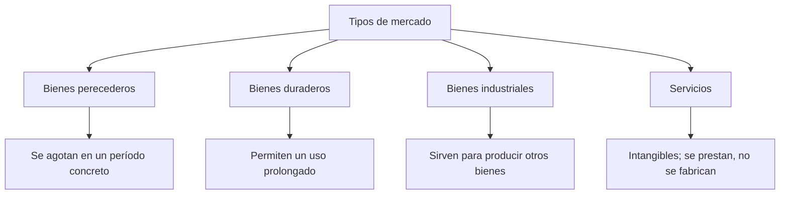

---

## 2. Segmentación del mercado

La segmentación del mercado consiste en seleccionar, entre todos los posibles clientes, aquellos que sean los más beneficiosos para la empresa, es decir, fijar nuestro **mercado meta**.

El mercado meta comprende tres etapas:

1. Segmentar el mercado.
2. Seleccionar el segmento o segmentos más adecuados.
3. Aplicar la estrategia más idónea a cada segmento.

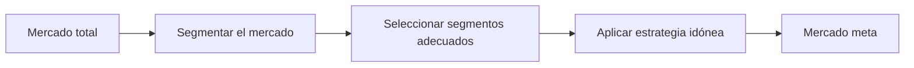

---

### 2.1. Criterios para segmentar y tipos de estrategias

#### Primera etapa

Consiste en segmentar el mercado de clientes en grupos homogéneos para llevar a cabo la estrategia comercial más adecuada en cada caso.

| Criterio de segmentación | Variables |
|---|---|
| **Demográfica** | Edad, género, estado civil, nacionalidad, etc. |
| **Geográfica** | Densidad de población, lugar de residencia, etc. |
| **Psicográfica** | Estilo de vida, valores, personalidad, intereses, etc. |
| **Socioculturales y económicos** | Nivel de estudios e ingresos, clase social, etc. |

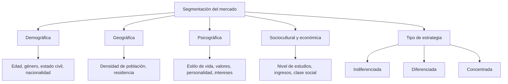

#### Ventajas de la segmentación

- Evaluar en cada segmento si están cubiertas o no sus necesidades.
- Adecuar los productos y las políticas de marketing a los gustos y preferencias de cada subgrupo.
- Preparar estrategias y presupuestos basados en una información fidedigna de las características de cada segmento específico.
- Asignar adecuadamente los recursos, de acuerdo con la importancia de cada segmento y los objetivos que persigue la empresa con ellos.
- Poder compaginar adecuadamente los mensajes publicitarios y los medios utilizados a las características y hábitos de cada segmento.
- Organizar mejor la red de distribución y los puntos de venta de la empresa, según las peculiaridades de cada segmento y sus características de consumo.

#### Segunda etapa

Tras la segmentación, lo siguiente es decidirnos por el segmento o segmentos que consideremos que nos proporcionarán el máximo beneficio.

#### Tercera etapa

Nos queda definir la estrategia a emplear teniendo en cuenta los diferentes segmentos que hayamos elegido.

> **Clic@**
>
> - [Segmentación del mercado (vídeo)](https://www.youtube.com/watch?v=7_04-l7hWIY)
> - [Segmentación geográfica Coca-Cola (vídeo)](https://www.youtube.com/watch?v=cjPtsBsDcrU)
> - [Segmentación de mercado Apple (vídeo)](https://www.youtube.com/watch?v=nbyOALabWZU)
> - [Apple con iPhone gana más que el resto de la industria móvil](https://acortar.link/uJTV8d)

#### Tipos de estrategias

##### Estrategia indiferenciada

- Se utiliza en empresas con pocos recursos económicos o en entornos poco competitivos o maduros.
- Se dirige a un universo de clientes amplio.
- Ejemplo: Coca-Cola antes tenía un producto para todo el mercado.

##### Estrategia diferenciada

- Requiere recursos económicos elevados.
- Se aplica en entornos muy competitivos.
- Identifica y cuantifica posibles tipos de clientes.
- Ejemplo: Coca-Cola actualmente produce distintos refrescos, envases, etc.

##### Estrategia concentrada

- Se centra en un nuevo nicho de mercado.
- La empresa se especializa en un determinado producto o servicio.
- Permite concentrar los recursos en el segmento que aportará mayor beneficio.
- Ejemplo: Coca-Cola Light atiende al consumidor preocupado por su imagen.

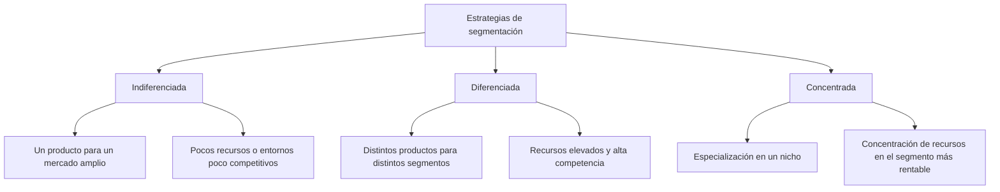

---

## 3. El marketing

El marketing es el conjunto de técnicas y estudios que tienen como objetivo mejorar la comercialización de un producto.

### Tipos de marketing

- **Marketing estratégico:** identifica el mercado meta o de referencia, permite segmentarlo y analizar las necesidades del mercado. También diseña productos rentables que consigan diferenciar a una empresa de sus competidores.
- **Marketing operacional:** representa un marketing de acciones diseñadas por el marketing estratégico para poner en marcha el plan de marketing de la empresa.

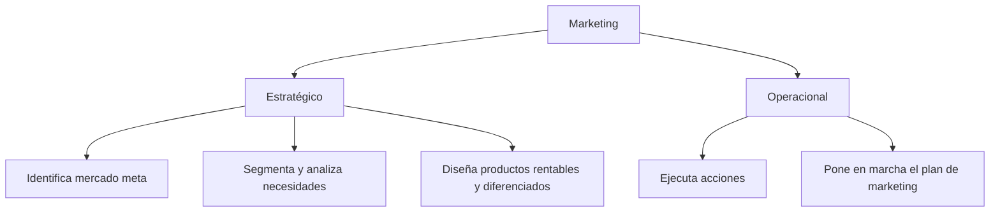

> **Clic@**  
> [Marketing y PYMES](https://www.marketingdepymes.com/)

### Plan de marketing o teoría de las 4 P

Las 4 P del marketing mix son:

- **Producto**
- **Precio**
- **Promoción**
- **Place / Plaza / Distribución**

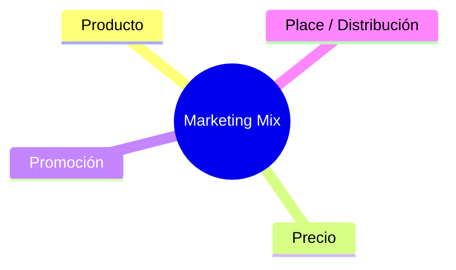

> **Clic@** — Marketing Mix 4P y ejemplos de marketing viral:
>
> - [Recurso 1 — Marketing Mix 4P](https://cutt.ly/GX1nrdd)
> - [Recurso 2 — Marketing viral](https://cutt.ly/sX1Ef9X)
> - [Recurso 3 — Marketing Mix](https://acortar.link/GwqStd)
> - [Recurso 4 — Ejemplos 4P](https://cutt.ly/yX1QCzt)

---

### 3.1. Producto

El producto es un bien o servicio susceptible de ser vendido.

#### 3.1.1. Niveles del producto

| Nivel | Descripción | Ejemplo |
|---|---|---|
| **Nivel básico** | Representa la necesidad que desea satisfacer el consumidor. | Al comprar ropa podemos cubrir la necesidad de vestirnos o también la de ir a la moda. |
| **Nivel formal** | Son las características o atributos que buscamos en el producto. | Al comprar un vehículo nos fijamos en la marca, modelo, diseño, prestaciones, etc. |
| **Nivel ampliado** | Factor diferenciador o valor añadido asociado a la compra. | Al contratar telefonía móvil tendremos en cuenta el servicio postventa, atención al cliente, averías, etc. |

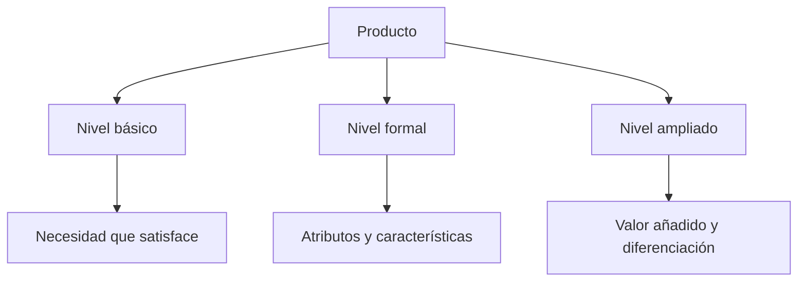

#### 3.1.2. Tipos de productos

| Criterio | Tipos | Descripción y ejemplos |
|---|---|---|
| **Según su tangibilidad** | Bienes | Elementos tangibles, físicos, que se pueden tocar. Se dividen en duraderos, como muebles, y no duraderos, como gasolina. |
| **Según su tangibilidad** | Servicios | Intangibles. Se producen y consumen al mismo tiempo. Ejemplo: un masaje. |
| **Según su finalidad** | De consumo | Destinados al consumo de particulares y hogares. Pueden ser básicos, de impulso, de emergencia, de comparación o de lujo. |
| **Según su finalidad** | Industriales | Sirven para producir otros bienes. Por ejemplo, comprar harina para hacer pan. |
| **Según su relación con la demanda de otros productos** | Bienes complementarios | Se consumen junto a otros productos. Por ejemplo, la impresora y el cartucho de tinta, o el coche y la gasolina o gasoil. |
| **Según su relación con la demanda de otros productos** | Bienes sustitutivos | Compiten en el mercado porque cubren una misma necesidad. Por ejemplo, aceite de oliva o aceite de girasol, mantequilla o margarina. |
| **Según su relación con la demanda de otros productos** | Bienes independientes | No tienen relación entre sí. Por ejemplo, una manzana y una tablet. |

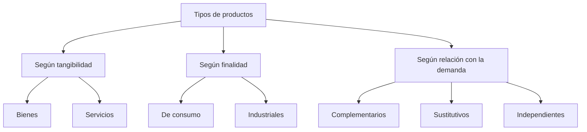

#### 3.1.3. Características de los productos

- **Atributos:** características tangibles del producto, como color, calidad, tamaño, diseño, etc.
- **Marca:** permite identificar los productos y diferenciarlos de los de la competencia.
- **Envase:** facilita el transporte, el almacenaje y la conservación de los productos, pero también permite diferenciar unos productos de otros.
- **Servicios adicionales:** se conocen como factores diferenciadores y ayudan a que los clientes se decanten por nuestros productos o servicios. Ejemplos: aparcamiento gratuito, reparto a domicilio, asistencia técnica, garantía o financiación.

> **Clic@** — El producto y sus características / «El nombre del producto»:
>
> - [El producto y sus características](https://cutt.ly/NX1RLIS)
> - [El nombre del producto](https://acortar.link/VwiI9)
> - [Vídeo: el producto en marketing](https://www.youtube.com/watch?v=W9LaKeRjXnw)

#### 3.1.4. Ciclo de vida del producto

| Fase | Descripción |
|---|---|
| **Introducción** | Se da a conocer el producto. El volumen de ventas es bajo y los costes son muy altos, por lo que requiere mucho esfuerzo comercial o publicitario. La competencia se mantiene al margen. |
| **Crecimiento** | La demanda del producto empieza a crecer al ser aceptado por el mercado. Comienza a reaccionar la competencia, atraída por el incremento rápido de las ventas. |
| **Madurez** | El crecimiento de las ventas se ralentiza. El producto ya está asentado y consolidado en el mercado y los beneficios son altos. Hay gran competencia entre empresas, a veces incluso agresiva. |
| **Declive** | Las ventas comienzan a decrecer significativamente y el producto se prepara para salir del mercado, de forma lenta o muy rápida. La competencia se reduce al abandonar algunas empresas la producción por baja rentabilidad. La vida del producto acabará cuando deje de venderse por completo. |


> **Clic@** — Ciclo de vida del producto:
>
> - [Ciclo de vida del producto (1)](https://cutt.ly/LX1P3gH)
> - [Ciclo de vida del producto (2)](https://cutt.ly/lX1AHRH)

---

### 3.2. Precio

El precio es el valor del producto expresado en términos monetarios.

#### Métodos para fijar el precio

| Método | Descripción |
|---|---|
| **Basado en los costes** | Se añade un margen de beneficio al coste total unitario. Puede ser una cantidad fija o un porcentaje. |
| **Basado en el comprador** | Se fija el precio en base a lo que estaría dispuesto a pagar el consumidor. |
| **Basado en la competencia** | Se fija el precio teniendo en cuenta el que ha establecido la competencia. |

En el método basado en la competencia se pueden aplicar tres estrategias:

- Fijar un precio igual al de la competencia.
- Fijar un precio por debajo de la competencia.
- Fijar un precio por encima de la competencia.

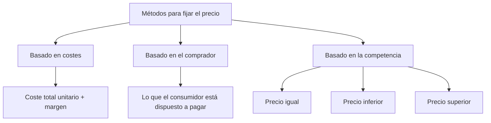

> **Clic@** — Métodos para fijar el precio:
>
> - [Métodos para fijar el precio (1)](https://cutt.ly/eX1SBdF)
> - [Métodos para fijar el precio (2)](https://cutt.ly/5X1GqPF)

#### Fórmulas para obtener el coste total unitario y el precio de venta

```txt
Coste total unitario = Costes totales (fijos + variables) / Total unidades vendidas

Precio de venta = Coste total unitario x (1 + % margen)
```

#### Estrategias de fijación de precios

| Estrategia | Descripción |
|---|---|
| **Penetración** | Se usa en la introducción de nuevos productos. Tiene como objetivo reducir los precios lo máximo posible por debajo de la competencia para captar a los primeros clientes. |
| **Desnatado** | Consiste en iniciar la vida del producto a un precio muy alto para que se perciba como un objeto muy valorado y, paulatinamente, ir reduciendo su precio para hacerlo accesible a todo el mundo. Ejemplos: primeros DVD, primeras teles LCD, tablets, consolas, etc. |
| **Único** | Todos los productos tienen el mismo precio. Ejemplo: tiendas todo a euro. |
| **Estacional** | Los precios se establecen según la temporada del año. Por ejemplo, un viaje al mismo destino según sea temporada baja o alta. |
| **Prestigio** | Juega con la percepción de asociar productos caros con calidad y productos económicos con baja calidad. |
| **Gancho** | Consiste en rebajar el precio de algunos productos para atraer a la clientela y conseguir que acaben llevándose otros productos que no estaban rebajados. |
| **Psicológico** | Busca que el cliente tenga la sensación de que cuesta menos. Los números impares terminados en 5 y 9 se perciben psicológicamente como una oportunidad. |
| **Cautivo** | Se emplea con productos que tienen una parte principal, normalmente de precio bajo, y una parte de complementos o accesorios con precio superior. Ejemplos: máquinas de afeitar y recambios, impresoras y cartuchos, máquinas de café y cápsulas. |

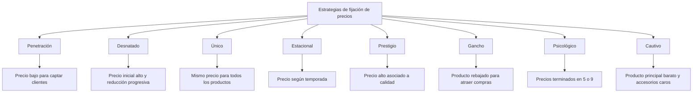

---

### 3.3. Promoción

La promoción se desarrolla mediante canales de comunicación.

Los canales de comunicación son los medios que utiliza una empresa para dar a conocer el producto a sus clientes.

> **Clic@**  
> [Canales de comunicación y promoción](https://cutt.ly/iX1Jo64)

#### Canales de comunicación

| Canal | Descripción |
|---|---|
| **Promoción de ventas** | Incentivos a corto plazo: muestras, vales descuento, sorteos promocionales, promociones en el lugar de ventas, etc. |
| **Venta directa** | Comercialización de bienes de consumo y servicios directamente al consumidor mediante un vendedor o representante. Sus funciones básicas son informar y dar a conocer el producto, persuadir para que lo compren y buscar nuevos clientes. |
| **Esponsorización** | Su objetivo es crear una imagen positiva de la empresa mediante eventos culturales, científicos, deportivos, etc. |

#### Publicidad: ventajas e inconvenientes

| Medio publicitario | Ventajas | Inconvenientes |
|---|---|---|
| **Buzoneo** | Selección geográfica de los posibles destinatarios. Coste asequible. | Poca permanencia del mensaje. Imagen de correo basura. |
| **Periódicos y revistas** | Permite seleccionar destinatarios por perfil. Buena imagen. | Baja calidad de impresión en periódicos. Coste elevado. |
| **Radio y televisión** | Gran audiencia y alto poder de atracción. Muy buena imagen. | Escasa permanencia del mensaje salvo repetición. Coste muy elevado. |
| **Publicidad exterior** | Ideal para publicitar productos de gran consumo. Permanencia del mensaje. | No hay selectividad de la audiencia. Le afecta la climatología. |
| **Redes sociales y páginas web** | Accesibilidad, inmediatez y ausencia de fronteras. Coste relativamente bajo. | Puede pasar desapercibida por exceso de publicidad. Riesgo de spam o publicidad molesta. |

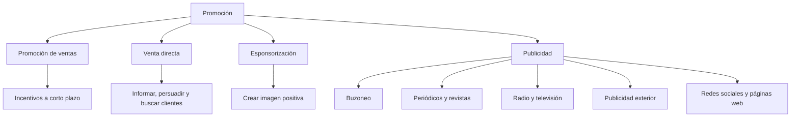

---

### 3.4. Place / Distribución

La distribución del producto es el camino que recorre un producto desde que es fabricado hasta que llega a los consumidores finales.

> **Clic@**  
> [Place / distribución del producto](https://cutt.ly/FX1L82e)

#### Canales de distribución

- **Canal ultra corto o directo:** fabricantes → consumidores.
- **Canal corto:** fabricantes → minoristas → consumidores.
- **Canal largo:** fabricantes → mayoristas → minoristas → consumidores.

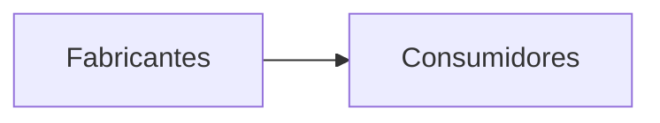

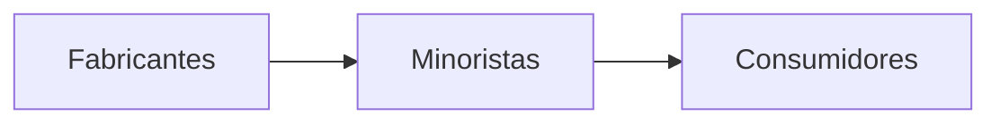

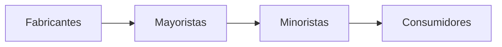

#### Estrategias de distribución

| Estrategia | Descripción |
|---|---|
| **Intensiva** | La empresa busca el mayor número posible de establecimientos minoristas para conseguir la máxima cobertura posible. |
| **Selectiva** | Se recurre a un número de puntos de venta inferior al disponible en una zona geográfica determinada. Los criterios de selección pueden ser la magnitud del distribuidor, la calidad del servicio y la cualificación técnica. |
| **Exclusiva** | Solo un grupo de minoristas elegidos pueden vender los productos de la marca, comprometiéndose a no vender otros productos de la competencia. |
| **Extensiva** | El fabricante utilizaría para la distribución de sus productos no solo todos los establecimientos de su rama comercial, sino incluso otros. |

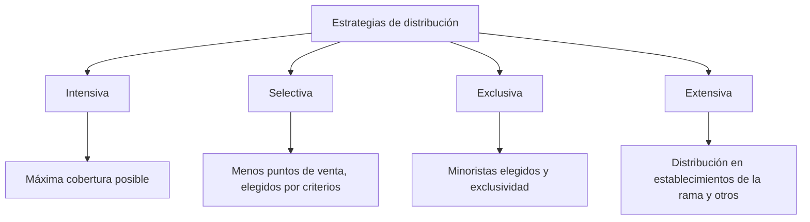

<BorderedSection>


## 4. La atención al cliente

> «La empresa que cuida al cliente se cuida a sí misma».

### Clases de técnicas de atención al cliente

| Técnica | Descripción |
|---|---|
| **Técnicas de comunicación** | Tienen como objetivo intentar saber qué es lo que quiere el cliente. |
| **Técnicas psicológicas** | Intentan llevar a nuestro terreno al cliente sin que se dé cuenta. |
| **Técnicas de confianza** | Tratan de crear un buen ambiente en el que sea fácil comprar. |

#### Objetivos de estas técnicas

- Saber atender llamadas.
- Saber tratar reclamaciones.
- Respetar la importancia del cliente.
- Tener capacidad para establecer las necesidades reales del cliente.

```mermaid
flowchart TD
    A[Atención al cliente] --> B[Técnicas de comunicación]
    A --> C[Técnicas psicológicas]
    A --> D[Técnicas de confianza]

    B --> B1[Saber qué quiere el cliente]
    C --> C1[Orientar al cliente]
    D --> D1[Crear un buen ambiente de compra]

    A --> E[Objetivos]
    E --> E1[Atender llamadas]
    E --> E2[Tratar reclamaciones]
    E --> E3[Respetar la importancia del cliente]
    E --> E4[Detectar necesidades reales]
```

### La curva de la insatisfacción

La curva de la insatisfacción muestra cómo la insatisfacción del cliente puede iniciar un ciclo negativo para la empresa.

```mermaid
flowchart LR
    A[Insatisfacción del cliente] --> B[Pérdida de clientes]
    B --> C[Márgenes de rentabilidad mínimos]
    C --> D[Insatisfacción del personal de la empresa]
    D --> E[Alta rotación del personal y desaparición de puestos de trabajo]
    E --> A
```

---

### 4.1. La quinta P: People / Personas

> «El cliente es la persona más importante de nuestro negocio».

#### Pautas de fidelización

- Seguimiento.
- Valor añadido.
- Resolver sus problemas.

```mermaid
flowchart TD
    A[People / Personas] --> B[Cliente]
    B --> C[Pautas de fidelización]
    C --> D[Seguimiento]
    C --> E[Valor añadido]
    C --> F[Resolver sus problemas]
```

> **Clic@**  
> [Atención al cliente (vídeo)](https://www.youtube.com/watch?v=1FRp9ZJYuIo)

---

## Recursos audiovisuales

### El marketing de los sentidos

- [El marketing de los sentidos](https://cutt.ly/LX9vWzr)
- [Neuromarketing (RTVE)](http://www.rtve.es/alacarta/videos/i/neuromarketing/1695505/)
- [Tres14 — Tiendas cerebro (RTVE)](http://www.rtve.es/alacarta/videos/tres14/tres14-tiendas-cerebro/477070/)

---

## Reto: plan de empresa

> **Ficha 6. Mercado y plan de marketing**

### Objetivo

Conocer el tipo de mercado en el que pretendes desarrollar la actividad y poner en práctica el marketing mix o teoría de las 4 P: producto, precio, distribución y promoción.

### Puntos a desarrollar

#### 1. Tipo y tamaño del mercado

Hay que indicar a qué tipo de mercado se va a dirigir, por ejemplo: bienes primarios, secundarios, terciarios, y cuál es su tamaño, teniendo en cuenta que dependerá del sector en el que se encuentre.

#### 2. Cuota de mercado

Ser capaces de establecer la participación o cuota de mercado del resto de empresas que ya están ofertando el mismo producto o servicio. En la web de las diferentes cámaras de comercio encontrarás información económica y bases de datos de todas las empresas del sector en el que pretendes operar.

#### 3. Mercado meta

Para poder determinar a quiénes van a ser nuestros clientes potenciales, debemos indicar qué criterios hemos empleado para realizar la segmentación del mercado: geográficos, demográficos, personales, familiares, conductuales, etc.

#### 4. Estrategia comercial

Tras la segmentación, se podrá plantear el tipo de estrategia comercial que puede ponerse en marcha para captar y fidelizar a los futuros clientes:

- Indiferenciada.
- Diferenciada.
- Concentrada.

#### 5. Plan de marketing

En base al tipo de cliente y estrategia elegida, desarrollar el marketing mix:

- **Producto:** niveles del producto o servicio, tipo de producto o servicio y ciclo de vida del mismo.
- **Precio:** ¿qué método se va a utilizar para fijar el precio? Basado en los costes, comprador, competencia, promoción. ¿Qué canales de comunicación se emplearán? ¿Por qué?
- **Place o distribución:** especificar el canal: corto, medio, largo.

> **Clic@**  
> [Ficha de apoyo — plan de marketing (Flexibook)](https://www.flexibook.es/?p=7920)

</BorderedSection>