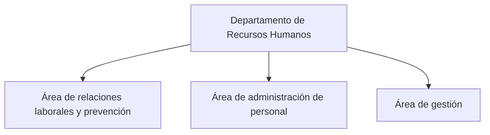
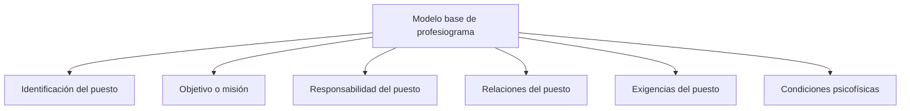
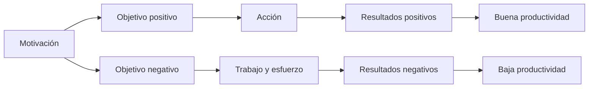
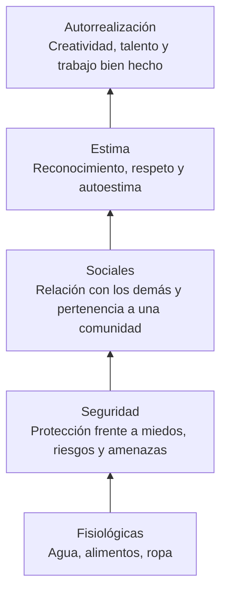
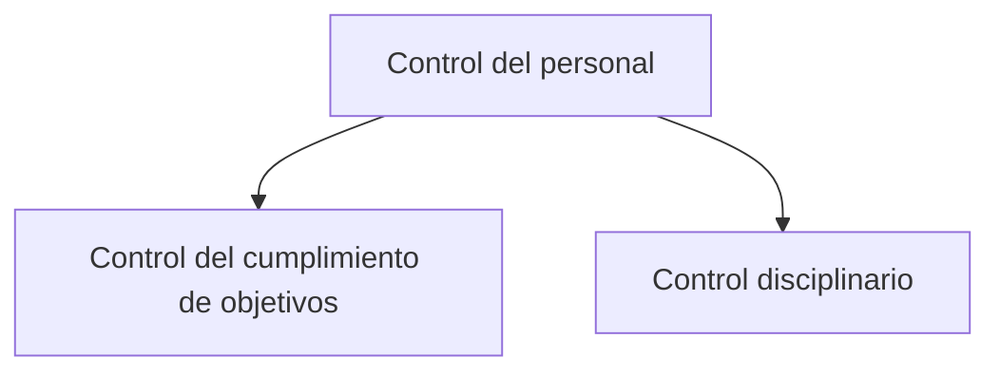
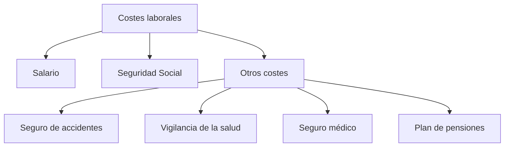
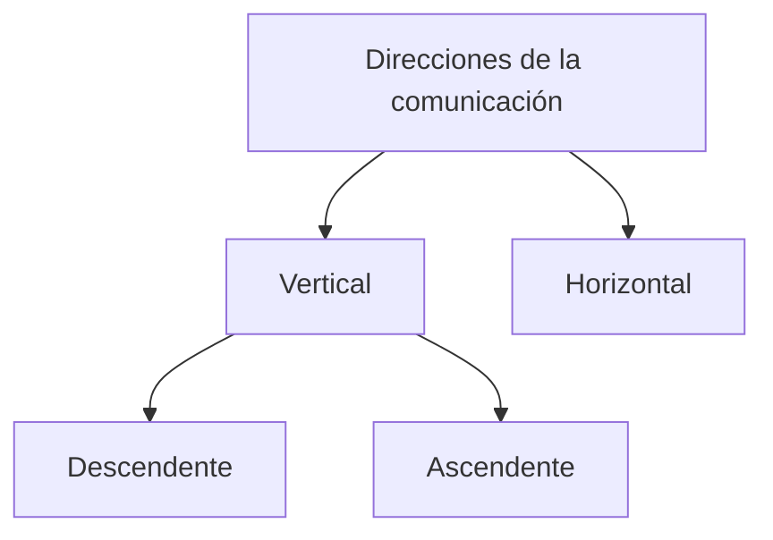

import BorderedSection from '../../../../components/bordered-section.astro';

> «El gran reto del departamento de RRHH es encontrar el equilibrio entre los intereses de la organización y sus empleados».

## Sumario

1. [Departamento de Recursos Humanos](#1-departamento-de-recursos-humanos)
2. [Funciones del departamento de RR.HH.](#2-funciones-del-departamento-de-rrhh)
3. [El proceso de selección de personal](#3-el-proceso-de-selección-de-personal)
4. [El control del personal](#4-el-control-del-personal)
5. [Los costes laborales](#5-los-costes-laborales)
6. [La comunicación en el departamento de RRHH](#6-la-comunicación-en-el-departamento-de-rrhh)

## Objetivos

- Conocer la estructura del departamento de RR.HH.
- Definir las funciones del departamento de personal.
- Establecer una relación directa entre motivación y rendimiento.
- Saber estructurar las diferentes fases del proceso de selección.
- Confeccionar las pruebas de selección, psicotécnicos y cuestionarios.
- Identificar el control de personal como un medio para recabar información.
- Cuantificar los costes laborales de todo el personal de la organización.

---

## 1. Departamento de Recursos Humanos

El **Departamento de Recursos Humanos** se divide en tres grandes áreas:

### Área de Relaciones Laborales y Prevención

Se encarga de la resolución de problemas laborales y de la seguridad e higiene de los trabajadores.

### Área de Administración de Personal

Se ocupa de funciones administrativas como:

- Elección de contratos.
- Nóminas y seguros sociales.
- Horas extras.
- Permisos.
- Vacaciones.
- Bajas.
- Control del absentismo.
- Régimen disciplinario.

### Área de Gestión

Comprende la selección, formación y desarrollo de los trabajadores en temas como:

- Motivación.
- Liderazgo.
- Enriquecimiento del trabajo.

---

## 2. Funciones del departamento de RR.HH.

| Tipo de función | Funciones principales |
|---|---|
| **Funciones laborales** | Establecer necesidades de personal, describir puestos, elaborar profesiogramas, seleccionar y formar al personal, preparar el plan de acogida y proponer modificaciones, suspensiones o extinciones de contratos. |
| **Funciones administrativas** | Elección y formalización de contratos, confección de nóminas y seguros sociales, tramitación de altas, bajas, permisos, vacaciones y excedencias, seguimiento del absentismo, expedientes disciplinarios y diseño del sistema de retribuciones. |
| **Funciones interpersonales** | Dirección, liderazgo, motivación, comunicación, trabajo en equipo y resolución de conflictos. |
| **Funciones preventivas** | Estructurar el departamento de prevención y determinar si es necesario un servicio médico y de prevención propio o ajeno. |
| **Funciones sociales y recreativas** | Guarderías, economatos, seguros privados, planes de pensiones, becas, ayudas para estudios, convenciones, viajes de empresa y actividades deportivas, culturales o de ocio. |

---

## 2.1. Profesiogramas

:::note[Definición]
El **profesiograma** es el instrumento que recoge los requisitos y exigencias que debe reunir un puesto de trabajo, así como los conocimientos, habilidades y competencias que debe poseer el trabajador.
:::

### 2.1.1. Ítems que incluye un profesiograma

Un profesiograma puede incluir:

- Identificación del puesto y características generales.
- Descripción de las tareas a realizar.
- Objetivo del puesto de trabajo.
- Experiencia y formación requerida.
- Responsabilidad del puesto.
- Relaciones del puesto de trabajo.
- Requisitos psicofísicos mínimos necesarios.
- Medios técnicos precisos.
- Condiciones de trabajo.

:::tip[Recurso externo]
[Ejemplos de profesiogramas](https://acortar.link/h2OIkc)
:::

### 2.1.2. Modelo base de profesiograma

### Ejemplo: modelo base de profesiograma para puesto comercial

| Apartado | Información |
|---|---|
| **Identificación del puesto** | Puesto de trabajo: comercial. Categoría: agente de seguros. Ramo: vida y empresa. Código: CB, Comerciales Base. |
| **Objetivo o misión** | Mantenimiento de la cartera de clientes, desarrollo de la línea de seguros de vida y prospecciones en el ramo de seguros de empresa. |
| **Responsabilidad del puesto** | Al tratarse de un puesto base, su responsabilidad se limita al cumplimiento de los objetivos establecidos en los ramos de vida y empresa. |
| **Relaciones del puesto** | Dependerá orgánicamente del director de la oficina y de los asesores de vida y empresa designados para tal fin. |
| **Exigencias del puesto** | Edad entre 18 y 25 años. Se valorará B1 de inglés. Formación: curso mediador de seguros. Experiencia mínima de 1 año en puesto similar. Manejo de nuevas tecnologías en entorno Windows. |
| **Condiciones psicofísicas** | Empatía, serenidad, sinceridad, extroversión, adaptabilidad, responsabilidad, capacidad negociadora y capacidad comunicadora. |

Escala de valoración de factores:

| Valor | Significado |
|---:|---|
| 1 | Nada favorable |
| 2 | Regular |
| 3 | Favorable |
| 4 | Muy favorable |

---

## 2.2. La motivación

:::note[Definición]
La **motivación** es lo que impulsa a una persona a actuar de una determinada manera y con un nivel de esfuerzo concreto.
:::

El grado de motivación depende del valor que se le dé al **objetivo** que se desea alcanzar. Si el objetivo motiva a la persona, el esfuerzo será el adecuado.

:::tip[Idea clave]
A mayor motivación, mayor implicación en el trabajo y mejor rendimiento.
:::

<BorderedSection>

## 2.2.1. Teoría de la jerarquía de las necesidades de Maslow

La motivación está estrechamente relacionada con el rendimiento, por eso los departamentos de RR.HH. ponen en práctica teorías que desarrollan este concepto.

Una de las teorías más representativas es la del psicólogo humanista **Abraham Maslow** (1908-1970), conocida como el **padre de la motivación**.

Maslow parte de la idea de que todas las personas tienen cinco tipos de necesidades que desean satisfacer, representadas jerárquicamente en forma de pirámide.

### Conclusiones de Maslow

- Hasta que no estén cubiertas las necesidades del escalón inferior, no se desearán satisfacer las del escalón inmediatamente superior.
- Una necesidad ya cubierta deja de ser motivadora.

### Aplicación en el entorno laboral

| Nivel | Necesidad | Ejemplo en la empresa |
|---|---|---|
| 1 | Fisiológicas | Contrato temporal o salario para cubrir necesidades básicas. |
| 2 | Seguridad | Contrato indefinido y aplicación de la Ley de Prevención de Riesgos. |
| 3 | Sociales | Buen clima laboral. |
| 4 | Estima | Promoción y reconocimiento del trabajo. |
| 5 | Autorrealización | Trabajo desafiante, creativo y con autonomía. |

:::tip[Recursos externos]
- [Pirámide de Maslow](https://cutt.ly/OywIJNM)
- [Recurso complementario sobre Maslow](https://cutt.ly/Wye5Ir9)
- [Vídeo sobre Maslow](https://cutt.ly/zX9QsgQ)
:::

</BorderedSection>

<BorderedSection>

## 2.2.2. Teoría de los dos factores de Frederick Herzberg

**Frederick Herzberg** fue un psicólogo norteamericano que estudió los puestos de trabajo y llegó a la conclusión de que los trabajadores están influenciados por dos tipos de factores.

| Factor | Descripción |
|---|---|
| **Factores higiénicos** | Rodean la actividad laboral. Tienen carácter externo y están relacionados con las condiciones laborales, salarios, relaciones con superiores y compañeros, etc. |
| **Factores motivadores** | Están relacionados con el contenido del trabajo. Tienen carácter interno y hacen referencia al reconocimiento del trabajo realizado, crecimiento personal y profesional, confianza de la organización, éxito y realización de un trabajo estimulante. |

### Reflexiones principales de Herzberg

#### A. Los factores higiénicos no son motivadores

Si se dan en sentido negativo, producen insatisfacción. Por ello, las empresas deben cuidar aspectos como:

- Retribuciones razonables.
- Condiciones ambientales adecuadas.
- Comunicación estrecha con todos los miembros de la organización.

#### B. Los factores motivadores producen alta satisfacción

Cuando están presentes en las organizaciones, generan satisfacción. Por ello, es necesario rediseñar los puestos de trabajo para que sean más desafiantes y enriquecedores.

Esto implica:

- Incrementar responsabilidades.
- Aumentar la autonomía.
- Mejorar la capacidad para tomar decisiones.
- Permitir que los recursos humanos aporten valor a la empresa.
- Alcanzar reconocimiento económico y profesional acorde al esfuerzo.

:::tip[Recurso externo]
[Teoría de los dos factores de Herzberg](https://cutt.ly/KX9N0YF)
:::

</BorderedSection>

## 2.2.3. Técnicas de motivación

| Técnica | Descripción |
|---|---|
| **Mejora de las condiciones laborales** | Supone no estar por debajo de los factores higiénicos propuestos por Herzberg y, en la medida de lo posible, mejorarlos. |
| **Enriquecimiento del trabajo** | Puede ser horizontal, aumentando o variando el número de funciones, o vertical, dando más autonomía y capacidad de decisión. |
| **Adecuación persona-puesto de trabajo** | Persigue incorporar en cada puesto al trabajador más adecuado según su perfil psicofísico. |
| **Participación y delegación** | La participación de los trabajadores más válidos en la planificación y la delegación de funciones incrementa el compromiso de pertenencia. |
| **Reconocimiento del trabajo** | Consiste en reconocer y valorar el trabajo bien hecho. |
| **Formación y desarrollo profesional** | La empresa forma y promociona a los trabajadores hacia puestos de mayor responsabilidad. |
| **Establecimiento de objetivos** | Los objetivos deben ser realistas, desafiantes y medibles. |

:::tip[Recurso externo]
[Así trabajan en Google](https://cutt.ly/hX91QOK)
:::

---

## 3. El proceso de selección de personal

El proceso de selección de personal permite elegir a la persona más adecuada para un puesto de trabajo.

### Fases, actuaciones y objetivos

| Fase | Actuaciones | Objetivos |
|---|---|---|
| **Análisis de puesto** | Perfil profesiográfico y características de los candidatos. | Formación básica, conocimientos, capacitación, experiencia necesaria, habilidades, aptitudes, personalidad y motivación. |
| **Reclutamiento** | Conseguir candidatos. | Anuncios en medios, banco de datos, colegios profesionales, centros de postgrado y redes sociales. |
| **Preselección** | Criba de candidaturas. | Descartar las candidaturas que no cumplen los requisitos. |
| **Realización de pruebas** | Pase de pruebas. | Pruebas aptitudinales, de personalidad y entrevistas. |
| **Elaboración de informes** | Resumen de las actuaciones. | Escoger a las personas que mejor se ajustan al perfil del puesto. |
| **Contratación** | Firma de contrato. | Selección de contrato e incorporación del candidato a la empresa. |
| **Incorporación** | Incorporación del trabajador a sus tareas. | Aplicación del manual de acogida. |

---

## 3.1. El análisis del puesto

:::note[Definición]
El **análisis del puesto** es el proceso por el que se establecen las tareas y responsabilidades de un puesto de trabajo, y se determina el tipo de persona que se quiere contratar para ocuparlo atendiendo a su capacidad y experiencia.
:::

En esta fase se recopila información del profesiograma general realizado por la empresa. Sirve para:

- Conocer las funciones que se van a realizar.
- Saber qué tipo de trabajador se necesita para ese puesto.
- Identificar si un trabajador está haciendo sus funciones correctamente.

---

## 3.2. Reclutamiento

:::note[Definición]
El **reclutamiento** es el proceso para conseguir candidatos que estén formados y se ajusten a los requisitos necesarios.
:::

El proceso de reclutamiento puede ser:

| Tipo | Descripción |
|---|---|
| **Reclutamiento interno** | Se realiza con trabajadores de la propia empresa. Su principal ventaja es que ya se conoce al trabajador y supone un incentivo, porque sabe que tiene posibilidades de ascender. |
| **Reclutamiento externo** | Se realiza buscando trabajadores de fuera de la empresa. Se suele emplear cuando no es posible cubrir los puestos vacantes con los propios trabajadores de la organización. |

:::tip[Recurso externo]
[Guía de inserción laboral Flexibook](https://acortar.link/RZMtx2)
:::

---

## 3.3. Preselección

La **preselección** es una primera criba de candidaturas en función de los datos del currículum y de las necesidades de la empresa.

Su objetivo es pasar a la fase de realización de pruebas únicamente a los candidatos más preparados, ahorrando tiempo y recursos.

---

## 3.4. Realización de pruebas

Los candidatos que superan la preselección realizan las pruebas necesarias para determinar su potencial y capacidad de aprendizaje.

En muchas ocasiones, estas pruebas las realiza una empresa externa de selección de Recursos Humanos o, en su defecto, un técnico en selección.

Las pruebas son principalmente de dos clases:

- Pruebas psicotécnicas y de personalidad.
- Entrevista de trabajo.

:::tip[Recursos externos]
- [Tests psicotécnicos y de personalidad](https://acortar.link/VD2mq8)
- [Psicotécnicos Test](https://www.psicotecnicostest.com/)
- [Corto: La entrevista](https://cutt.ly/IywObAa)
:::

---

## 3.5. Elaboración de informes

Es la fase de presentar toda la información obtenida, organizarla, analizarla y elaborar los informes para escoger al candidato que mejor se ajuste al perfil del puesto.

---

## 3.6. Contratación

El proceso de incorporación de un trabajador a la empresa termina con la **contratación**.

En esta fase se firma el contrato correspondiente y se formaliza la relación laboral.

---

## 3.7. Incorporación del trabajador

Hasta este momento se han valorado los conocimientos, aptitudes y actitudes del candidato.

A partir de la incorporación, el candidato se convierte en un nuevo compañero. Para facilitar el proceso de integración es recomendable que la empresa disponga de un **manual de acogida**.

### El manual de acogida sirve para

- Hacer que el nuevo trabajador se sienta integrado en la empresa.
- Conocer las características esenciales de la organización.
- Favorecer la comunicación.
- Dar imagen de seriedad.

### El contenido del manual de bienvenida incluye

- Datos de la organización: misión, visión, valores y datos históricos relevantes.
- Organigrama de la compañía.
- Funcionamiento interno: pago de salarios, vacaciones, horario de trabajo y ventajas sociales.

:::tip[Recurso externo]
[Modelo de manual de acogida](https://acortar.link/ct6bvC)
:::

---

## 4. El control del personal

El control del personal cumple principalmente dos funciones:

---

## 4.1. Control del cumplimiento de objetivos

El control del cumplimiento de objetivos se basa en sistemas de captación de información.

| Sistema | Descripción |
|---|---|
| **Registros** | Número de ventas, clientes, prospecciones realizadas, horas trabajadas, absentismo, etc. |
| **Observación directa** | El trabajador nunca debe tener conocimiento de que está siendo observado. |
| **Cuestionarios** | Están condicionados por el grado de anonimato de la encuesta. |
| **Informes** | Informes sobre el rendimiento de los trabajadores que una persona tiene a su cargo. |
| **Auditorías** | Pueden ser internas o externas. |

---

## 4.2. Control disciplinario

Las medidas disciplinarias pueden tener carácter:

| Tipo | Descripción |
|---|---|
| **Preventivo** | El conocimiento de las faltas y sanciones por incumplimiento suele ser un buen medio disuasorio o preventivo. |
| **Correctivo** | Son medidas o sanciones aplicadas con intención de que el trabajador corrija su comportamiento. |
| **Progresivo** | Las sanciones se hacen más severas a medida que se repiten las faltas. |

---

## 5. Los costes laborales

Los **costes laborales** están formados por el salario, la Seguridad Social y otros costes asociados.

### Salario

El salario dependerá de la categoría profesional del trabajador y viene recogido en el convenio colectivo de su sector.

### Seguridad Social

La Seguridad Social suele representar entre el **30 % y el 40 %** del salario bruto mensual del trabajador.

Para calcular su coste real se aplican los porcentajes correspondientes sobre la nómina del trabajador:

- **Base de contingencias comunes:** porcentajes establecidos para la empresa según los tipos de cotización de la Seguridad Social.
- **Base de contingencias profesionales:** tarifa de porcentajes regulada por la Ley 42/2006 sobre cotización por accidentes de trabajo y enfermedades profesionales.

### Otros costes

Los otros costes vienen determinados por las empresas. Entre los más habituales están:

- Seguro de accidentes.
- Servicio de vigilancia de la salud.
- Seguro médico.
- Plan de pensiones.

:::tip[Recursos externos]
- [Tarifa plana de Seguridad Social - BOE](http://www.boe.es/boe/dias/2014/03/01/pdfs/BOE-A-2014-2220.pdf)
- [Recurso sobre Seguridad Social](https://cutt.ly/HfcmsWQ)
- [Tarifa de primas AT/EP](https://acortar.link/gckdkc)
:::

---

## 6. La comunicación en el departamento de RRHH

La comunicación dentro del departamento de Recursos Humanos puede tener diferentes direcciones.

### Comunicación vertical

La comunicación vertical se produce entre distintos niveles jerárquicos de la empresa.

Puede ser:

- **Descendente:** desde puestos superiores hacia puestos inferiores.
- **Ascendente:** desde puestos inferiores hacia puestos superiores.

### Comunicación horizontal

La comunicación horizontal se produce entre personas o departamentos situados en un mismo nivel jerárquico.

---

## 6.1. Barreras de la comunicación

| Barrera | Descripción |
|---|---|
| **Personales** | Interferencias producidas por malos hábitos de escucha, creencias, prejuicios o personalidad de los interlocutores. |
| **Físicas** | Alteraciones producidas por ruido, temperatura baja o alta, o escasez de iluminación. |
| **Fisiológicas** | Provocadas por una disfunción corporal, como problemas de audición, visión o trastornos del habla. |
| **Semánticas** | Relacionadas con una mala interpretación de las palabras. |

---

## Recursos audiovisuales

:::tip[La importancia de los departamentos de Recursos Humanos]
- [Vídeo 1](https://www.youtube.com/watch?v=raQA2IVxx4A)
- [Vídeo 2](https://www.youtube.com/watch?v=JGfQwPgeibg)
- [Vídeo 3](https://www.youtube.com/watch?v=Dy-znJgR79M)
:::

---

## Reto: Plan de empresa

:::note[Ficha 7: Plan de Recursos Humanos]
El objetivo es establecer la estructura del departamento de RR.HH. y reconocer la importancia del mismo en la consecución de los objetivos de la empresa.
:::

### Puntos a desarrollar

1. **Departamento de RR.HH.**
   - Explicar la relevancia del departamento de RR.HH.
   - Mencionar las funciones que desarrolla dentro de la empresa.

2. **Estructura**
   - Indicar quién será el encargado de dirigir el departamento.
   - Explicar si la estructura será interna o si se externalizarán funciones.

3. **Profesiograma**
   - Preparar un profesiograma o descripción de puestos, detallando cada uno de los perfiles psicofísicos requeridos.

4. **Motivación**
   - Establecer un cuestionario para conocer el grado de motivación de los trabajadores.
   - Definir elementos motivadores que se aplicarán en la organización.

5. **Proceso de selección**
   - Establecer un protocolo para optimizar el proceso de selección.
   - Fijar la fase de pruebas psicotécnicas, aptitudinales, una batería de test y una entrevista o cuestionario de preguntas.

6. **Contratación**
   - Determinar los modelos de contrato necesarios para los distintos tipos de puestos a cubrir.
   - Adjuntar el documento que exige la normativa vigente o indicar dónde se obtiene toda la información necesaria.

7. **Acogida**
   - Presentar el manual de acogida que sirva de guía a los nuevos trabajadores.

8. **Costes laborales**
   - Establecer el coste laboral de todo el personal de la empresa, distinguiendo salario y Seguridad Social.

:::tip[Recurso externo]
[Ficha del reto en Flexibook](https://www.flexibook.es/?p=7955)
:::
