import BorderedSection from '../../../../components/bordered-section.astro';

:::caution[Importante]
REVISAR ESTA UNIDAD MANUALMENTE
:::

## Unidad 8. Inversión y financiación

> “Antes de saber cuánto dinero necesita una empresa, hay que diferenciar qué se va a invertir, qué se va a gastar y de dónde se obtendrán los recursos económicos.”

:::note[Objetivo de la unidad]
Comprender las necesidades iniciales de inversión y gasto de una empresa, identificar las principales fuentes de financiación y distinguir entre financiación propia, financiación ajena, ayudas públicas y crowdfunding.
:::

## Contenidos

1. [La inversión y los gastos iniciales](#la-inversión-y-los-gastos-iniciales)
2. [La financiación de la empresa](#la-financiación-de-la-empresa)
3. [Fuentes de financiación propias](#fuentes-de-financiación-propias)
4. [Fuentes de financiación ajenas](#fuentes-de-financiación-ajenas)
5. [Ayudas y subvenciones públicas](#ayudas-y-subvenciones-públicas)
6. [Crowdfunding](#crowdfunding)
7. [Amplía: buscador de ayudas IPYME](#amplía-buscador-de-ayudas-ipyme)

## La inversión y los gastos iniciales

Tras estudiar los costes y antes de determinar el dinero necesario para iniciar una actividad empresarial, es preciso elaborar un **plan de inversiones y gastos iniciales**.

### Inversión

Una **inversión** es la compra de un bien o derecho duradero para la empresa, ya que se va a utilizar durante más de un año.

Ejemplos de inversiones iniciales:

- Local.
- Instalaciones.
- Mobiliario.
- Maquinaria.
- Herramientas y útiles.
- Vehículos.
- Equipos informáticos.
- Programas informáticos.
- Patentes y marcas.

### Gasto

Un **gasto** es la compra de un bien, servicio o derecho que la empresa va a consumir de forma inmediata. Su uso suele ser inferior a un año.

Ejemplos de gastos iniciales:

- Gastos de constitución.
- Gastos de lanzamiento.
- Alquiler de locales.
- Sueldos y Seguridad Social.
- Suministros.
- Servicios profesionales.
- Material de oficina.
- Stock mínimo para la venta.
- Gastos financieros.

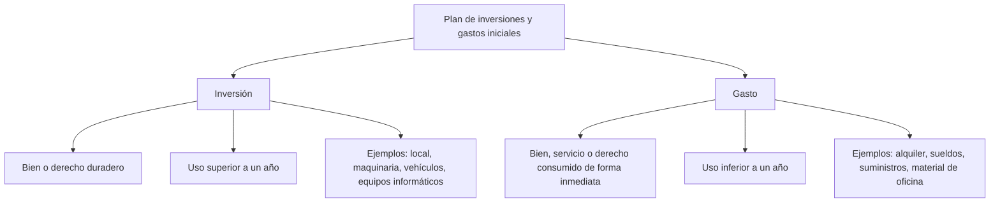

## La financiación de la empresa

La **financiación** es la obtención de recursos económicos para poder pagar las inversiones y los gastos de la empresa.

La pregunta clave es:

> ¿De dónde obtiene la empresa el dinero necesario para funcionar?

### Tipos principales de financiación

| Tipo de financiación | Procedencia | ¿Hay que devolverla? |
|---|---|---|
| **Fuentes de financiación propias** | Aportaciones de socios, inversores o beneficios generados por la empresa | No |
| **Fuentes de financiación ajenas** | Bancos, otras empresas, particulares u organismos externos | Sí |

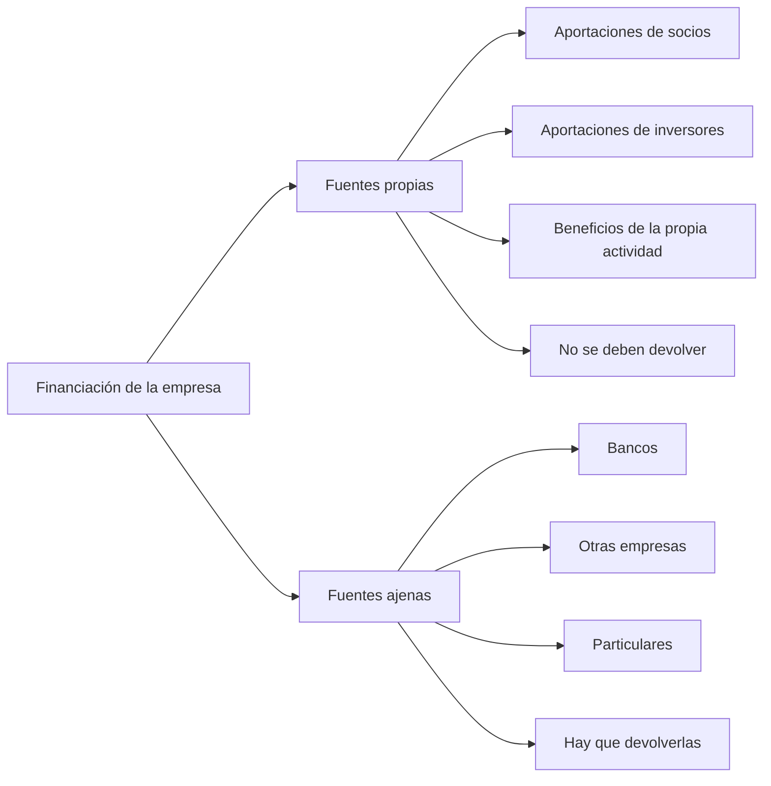

### Esquema general de fuentes propias

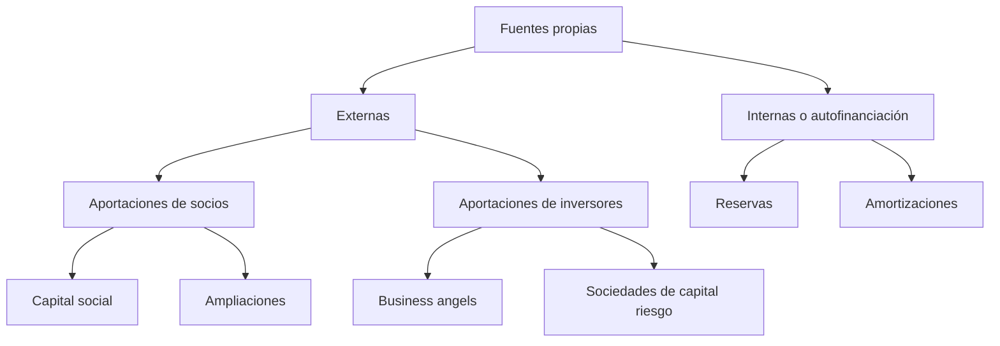

### Esquema general de fuentes ajenas

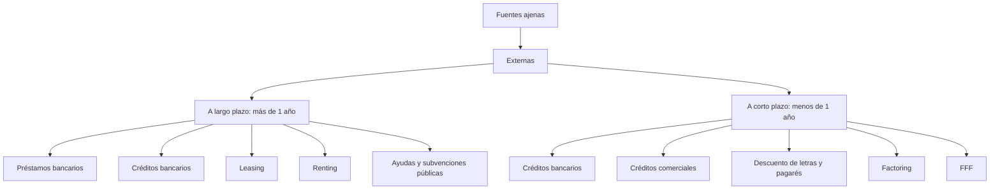

<BorderedSection>

### 3.2. Conceptos de liquidez y solvencia

Este apartado queda marcado como **no evaluable**. Solo se incluyen los conceptos básicos de **liquidez** y **solvencia**.

#### Liquidez

La **liquidez** es la capacidad que tiene una empresa para convertir sus bienes o derechos en dinero disponible a corto plazo.

Una empresa tiene buena liquidez cuando puede atender pagos inmediatos como:

- Facturas de proveedores.
- Nóminas.
- Alquileres.
- Suministros.
- Deudas a corto plazo.

:::tip[Idea clave]
La liquidez responde a esta pregunta: **¿puede la empresa pagar sus obligaciones más inmediatas?**
:::

#### Solvencia

La **solvencia** es la capacidad que tiene una empresa para hacer frente al conjunto de sus deudas y obligaciones, especialmente a medio y largo plazo.

Una empresa solvente posee recursos suficientes para responder ante sus deudas, aunque no todo su patrimonio esté disponible en efectivo de forma inmediata.

:::tip[Idea clave]
La solvencia responde a esta pregunta: **¿puede la empresa hacer frente a sus deudas en general?**
:::

#### Diferencia entre liquidez y solvencia

| Concepto | Se centra en | Horizonte temporal | Pregunta clave |
|---|---|---|---|
| **Liquidez** | Dinero disponible o fácilmente convertible en efectivo | Corto plazo | ¿Puede pagar ahora? |
| **Solvencia** | Capacidad global para responder ante las deudas | Medio y largo plazo | ¿Puede pagar sus deudas en general? |

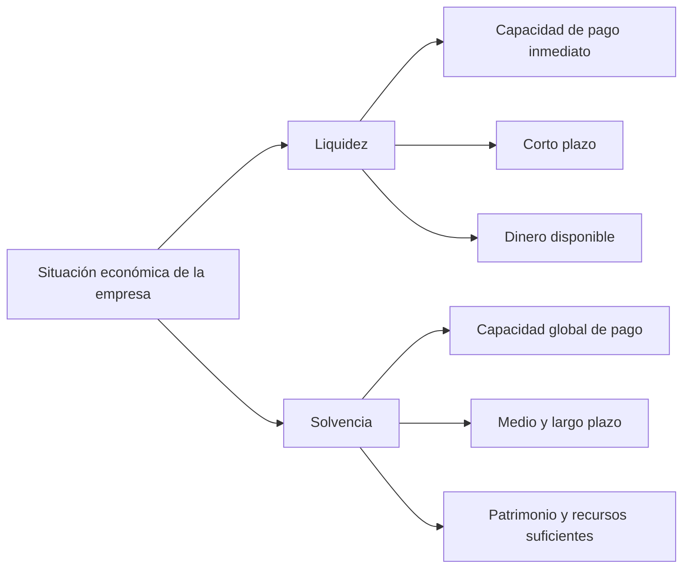

</BorderedSection>

## Fuentes de financiación propias

Las **fuentes de financiación propias** son recursos que pasan a ser propiedad de la empresa. Pueden proceder de aportaciones externas o de la propia actividad empresarial.

### Clasificación

| Tipo | Fuente | Explicación |
|---|---|---|
| **Externas** | Aportaciones de socios | Capital aportado por los socios al crear la empresa o mediante ampliaciones posteriores |
| **Externas** | Inversores | Capital aportado por personas o entidades que buscan rentabilidad futura |
| **Internas** | Autofinanciación | Recursos generados por la propia actividad de la empresa |

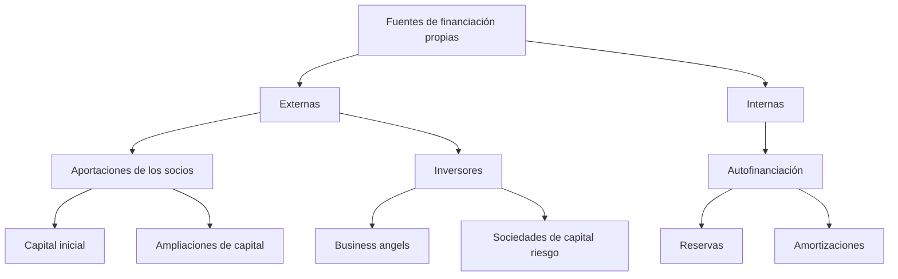

### Aportaciones de los socios

Al crear la empresa, los socios aportan un **capital inicial**, que puede entregarse en dinero o en bienes.

El capital puede variar con el tiempo mediante:

- **Ampliaciones de capital**.
- Entrada de **nuevos socios**.

### Inversores

Los inversores aportan recursos a la empresa con la expectativa de obtener una rentabilidad futura.

#### Business angels

Los **business angels** son inversores individuales que ofrecen:

- Capital.
- Conocimientos técnicos.
- Experiencia.
- Red de contactos.

Suelen invertir en pequeñas empresas en sus primeras fases y se implican en el proyecto.

Su objetivo es obtener una **plusvalía** o rendimiento a medio plazo al revender su participación.

#### Sociedades de capital riesgo

Las **sociedades de capital riesgo** son empresas que participan en el capital de otras empresas con gran potencial de crecimiento y rentabilidad, aunque también con un riesgo elevado.

Su objetivo es que la empresa crezca, se consolide y, pasado un tiempo, vender su participación obteniendo una plusvalía.

Empresas que pueden financiar:

| Tipo de empresa | Tipo de financiación |
|---|---|
| Emprendedores | Capital semilla |
| Empresas al inicio de su actividad, o *start-up* | Capital de inicio |
| Empresas en fase de crecimiento | Expansión de capital |

### Autofinanciación

La **autofinanciación** es la financiación que consigue la empresa a través de su propia actividad.

#### Reservas

Las **reservas** son la parte de los beneficios que la empresa deja sin repartir entre los socios y mantiene dentro de la empresa.

#### Amortizaciones

Las **amortizaciones** representan la pérdida de valor de un bien de inversión por uso o por obsolescencia. Esa pérdida se refleja como un gasto en la empresa.

## Fuentes de financiación ajenas

La **financiación ajena** supone una deuda para la empresa. Se utiliza cuando no se dispone de fondos propios suficientes.

Puede clasificarse en:

- **Financiación ajena a largo plazo**: devolución superior a un año.
- **Financiación ajena a corto plazo**: devolución inferior a un año.

Principales fuentes de financiación ajena:

- Préstamo bancario.
- Crédito bancario.
- Leasing y renting.
- Créditos comerciales de proveedores.
- Descuento de letras y pagarés.
- Factoring.
- Confirming.

## Préstamo bancario

El **préstamo bancario** es una de las fuentes más utilizadas para financiar grandes cantidades de dinero que se devuelven en varios años.

### Características principales

| Elemento | Descripción |
|---|---|
| **Capital** | Cantidad de dinero prestada por el banco |
| **Tipo de interés** | Porcentaje aplicado al capital prestado |
| **Intereses del préstamo** | Cantidad que se paga por recibir el dinero prestado |
| **Cuota mensual** | Suma de capital e intereses que se devuelve periódicamente |
| **Comisión de apertura y estudio** | Coste inicial por la tramitación del préstamo |
| **TAE** | Tipo de interés real que permite comparar préstamos |
| **Comisión de cancelación o amortización anticipada** | Coste por devolver el préstamo antes del plazo pactado |
| **Plazo de devolución** | Tiempo establecido para devolver el préstamo |
| **Avalista** | Persona o entidad que responde si la empresa no paga |
| **Seguros de vida** | Garantía adicional que puede exigir la entidad financiera |

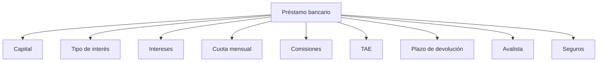

## Crédito bancario

En el **crédito bancario**, el banco pone a disposición de la empresa una cantidad de dinero en una cuenta de crédito.

La empresa pagará:

- Intereses por las cantidades utilizadas.
- Un interés menor por la cantidad disponible pero no utilizada.

El plazo suele estar entre **seis meses y un año**. El pago de intereses suele ser trimestral y, al final del periodo, se devuelve la totalidad del dinero dispuesto. También puede existir la posibilidad de renovación.

### Póliza de crédito

La **póliza de crédito** es una modalidad de crédito en la que es posible realizar ingresos y disposiciones de dinero según las necesidades de la empresa.

### Diferencias entre préstamo y crédito

| Préstamo | Crédito |
|---|---|
| El importe total se entrega el primer día | Se pone a disposición una cantidad que puede utilizarse o no |
| Se pagan intereses por toda la cantidad del préstamo | Se pagan intereses por la cantidad usada y por la no utilizada |
| Suele ser a largo plazo | Suele ser a corto plazo |
| Se utiliza para financiar inversiones o bienes de larga duración | Se utiliza para comprar mercaderías o cubrir necesidades temporales de liquidez |

## Leasing y renting

El **leasing** y el **renting** sirven para financiar inversiones en activos de la empresa como vehículos, maquinaria, ordenadores o mobiliario.

Se utilizan especialmente cuando esos activos pueden quedarse obsoletos o perder valor en poco tiempo.

:::tip[Ventaja principal]
En lugar de comprar el activo, la empresa lo alquila mientras está en condiciones de ser usado. Así evita realizar un gran desembolso inicial y puede renovarlo con mayor facilidad.
:::

Las cuotas de alquiler son un **gasto deducible**.

### Diferencias entre leasing y renting

| Renting | Leasing |
|---|---|
| Contrato de alquiler de un activo mueble de la empresa | Contrato de alquiler de un activo con opción a compra |
| Incluye mantenimiento, reparaciones y seguros | No suele cubrir mantenimiento, reparaciones ni seguros |
| No tiene opción de compra | Permite devolverlo, comprarlo o renovar el contrato |
| Puede ser utilizado por particulares y empresas | Se utiliza principalmente para financiar activos empresariales |

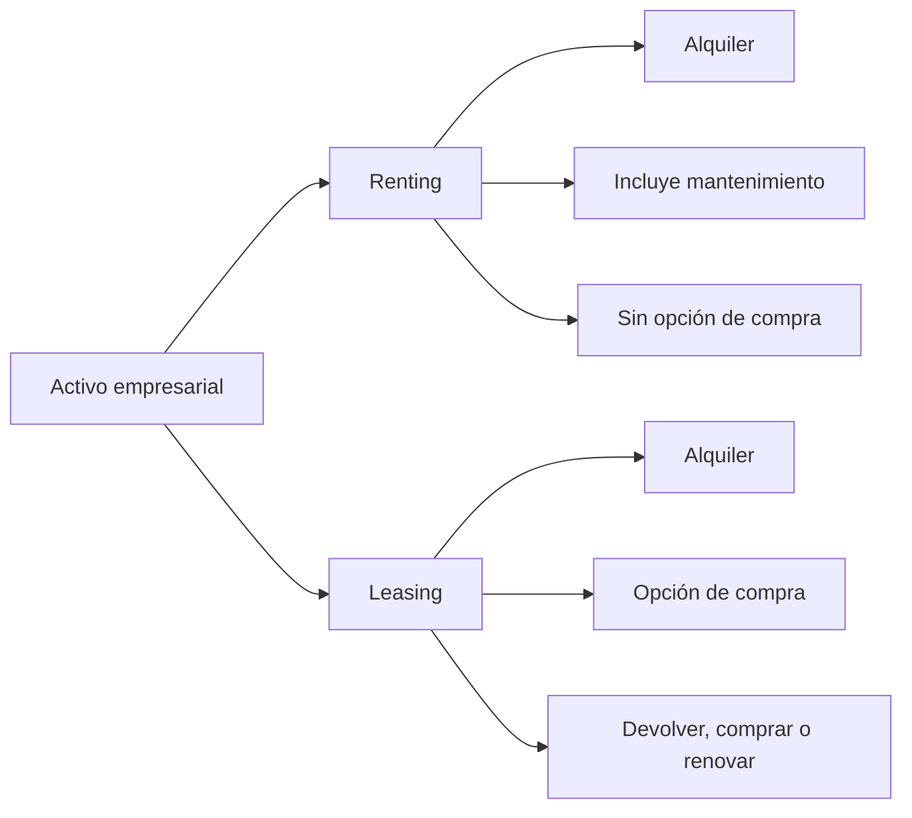

## Créditos comerciales de proveedores

Los **créditos comerciales de proveedores** aparecen cuando las empresas compran mercaderías y no las pagan al contado, sino en un plazo de 30 o 60 días sin intereses añadidos.

Esto supone una fuente de financiación porque permite vender las mercaderías antes de pagarlas.

:::note[Ejemplo]
Si el proveedor no permitiera pagar a 30 o 60 días, la empresa tendría que pagar las mercaderías antes de venderlas. Para hacerlo, quizá tendría que acudir a otras fuentes de financiación con intereses.
:::

## Descuento de letras y pagarés

Las **letras** y los **pagarés** son formas habituales de pago en relaciones comerciales. En ellos se indica que el pago se realizará en una fecha determinada, normalmente a 30 o 60 días.

Si la empresa necesita el dinero antes del vencimiento, puede acudir al banco y solicitar el anticipo de la letra o el pagaré.

### Funcionamiento

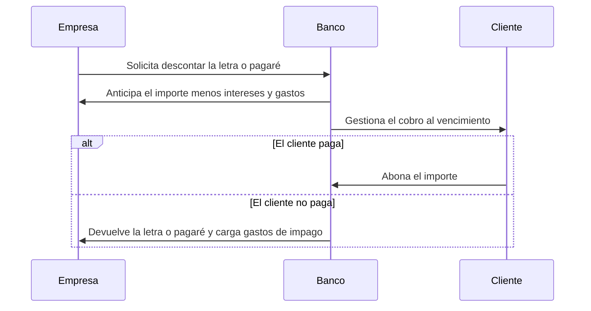

Para utilizar esta opción, la empresa debe tener abierta una **línea de descuento**.

## Factoring

El **factoring** es una forma de financiación similar al descuento.

La empresa contrata con otra empresa la cesión del cobro de sus clientes. La empresa de factoring anticipa parte del crédito pendiente de cobro.

### Diferencias con el descuento

En el factoring:

- No se anticipa necesariamente el importe total, sino un porcentaje según la seguridad de cobro.
- Pueden añadirse servicios como:
  - Asumir el riesgo de impago.
  - Estudiar la solvencia de los clientes.
  - Realizar gestiones administrativas.

## Confirming

El **confirming** es lo contrario del factoring.

En este caso, los bancos ofrecen a las empresas gestionar sus pagos a proveedores. El banco se encarga de pagar a los proveedores en la fecha de vencimiento.

Este servicio se ofrece a empresas que tienen seguridad de que podrán pagar a sus proveedores.

## Ayudas y subvenciones públicas

Las Administraciones Públicas ofrecen ayudas y subvenciones a los emprendedores.

:::caution[Importante]
Las ayudas públicas no deben entenderse como un fondo inicial para abrir un negocio. Normalmente no se conceden antes de comenzar la actividad.
:::

El emprendedor primero debe invertir en su empresa y después solicitar las ayudas si cumple los requisitos.

Las ayudas públicas:

- Tardan en llegar.
- Suelen exigir documentación.
- Funcionan más como una **reducción de la inversión y los gastos ya pagados** que como un capital inicial.

## Líneas ICO

Las líneas ICO proceden del **Instituto Oficial de Crédito** y sirven para facilitar financiación en determinadas condiciones.

| Elemento | Descripción |
|---|---|
| **Tipo de ayuda** | Reducción del tipo de interés en el préstamo solicitado a un banco |
| **Dirigido a** | Autónomos, empresas, particulares y comunidades de propietarios |
| **Importe máximo** | Hasta 12,5 millones |
| **Conceptos financiables** | Inversiones, activos fijos productivos, vehículos turismo inferiores a 30.000 €, adquisición de empresas y rehabilitación de viviendas |
| **Liquidez** | Permite cubrir necesidades de circulante |
| **Tipo de interés** | Fijo o variable, normalmente Euríbor a 6 meses más un diferencial |
| **Amortización si financia inversión** | De 1 a 20 años |
| **Amortización si financia liquidez** | De 1 a 4 años |
| **Comisiones** | Solo pueden cobrar una comisión inicial y, en su caso, por cancelación anticipada |
| **Garantías** | Las determina la entidad de crédito |
| **Compatibilidad** | Compatible con otras ayudas |

## Crowdfunding

El **crowdfunding** es una forma de financiación colectiva en la que muchas personas aportan dinero a través de internet.

El emprendedor presenta un proyecto y solicita que cualquier persona pueda realizar una pequeña aportación.

### Tipos de crowdfunding

| Tipo | Característica principal |
|---|---|
| **De recompensa** | Es el más habitual. Se ofrece una recompensa según la aportación realizada |
| **De inversión** | Los participantes invierten esperando obtener una rentabilidad futura |
| **De préstamo** | Las aportaciones funcionan como préstamos que deberán devolverse |
| **De donación** | Las personas aportan dinero sin esperar una contraprestación económica |

### Funcionamiento básico

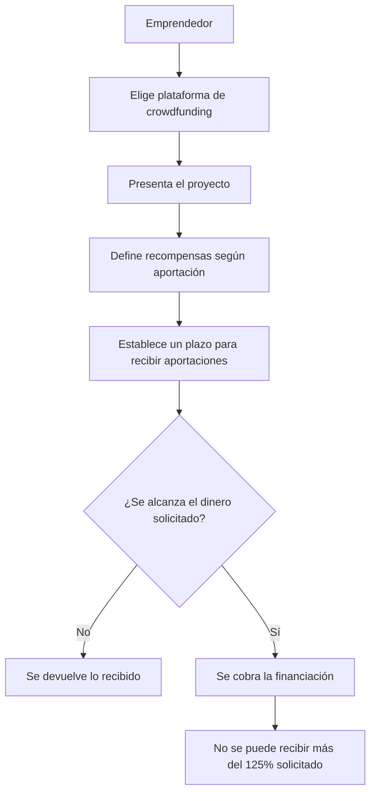

### Límites para particulares

Se diferencia entre **inversores acreditados** y **particulares**.

Los particulares tienen límites de inversión:

- 3.000 € por empresa.
- 6.000 € por plataforma.

## Amplía: buscador de ayudas IPYME

Las **Guías dinámicas de ayudas e incentivos para empresas** recogen ayudas e incentivos convocados por:

- Administración General del Estado.
- Administraciones autonómicas.
- Administraciones locales.
- Otros organismos públicos.

Estas guías se actualizan constantemente y muestran ayudas con el plazo de solicitud abierto.

[Consultar guías dinámicas de IPYME](http://www.ipyme.org/es-ES/GuiasDinamicas/Paginas/Guiasdinamicas.aspx)

## Resumen visual de la unidad

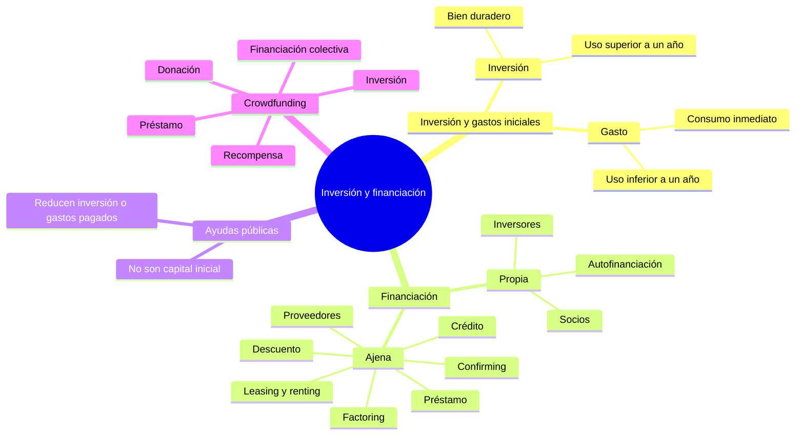
