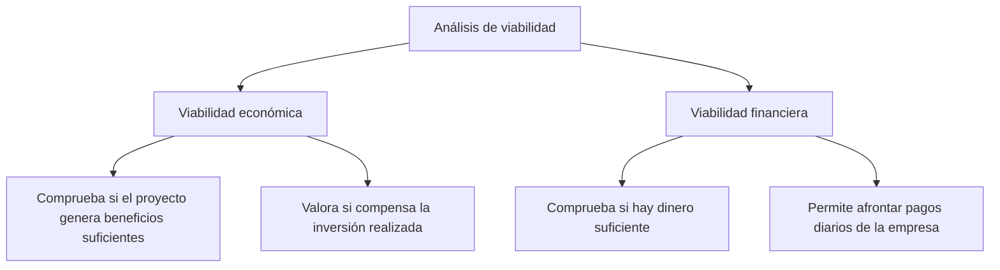
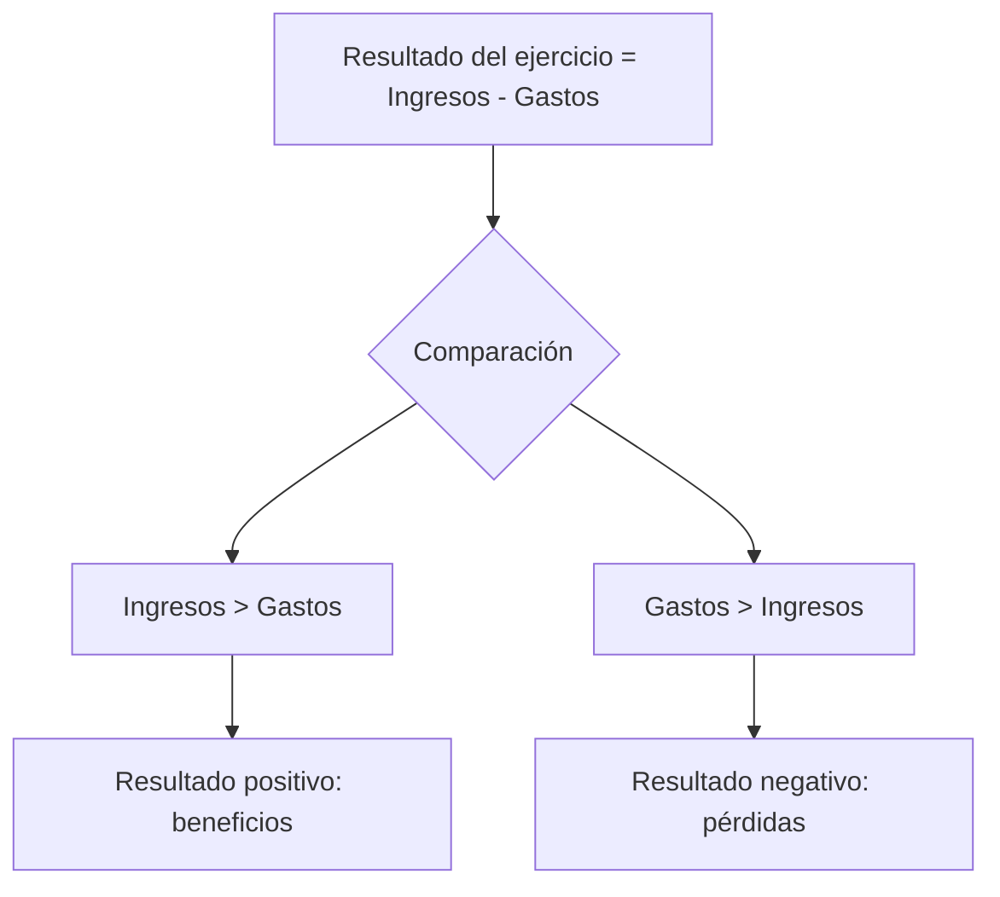
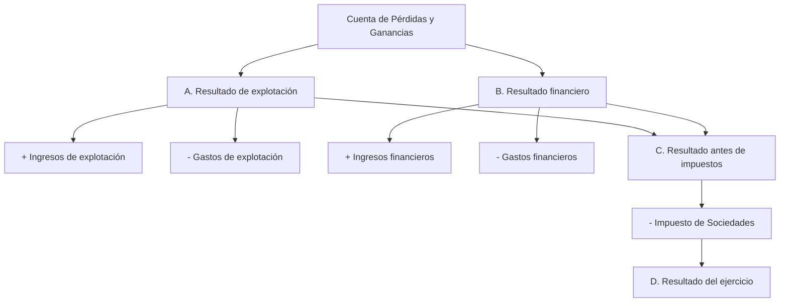
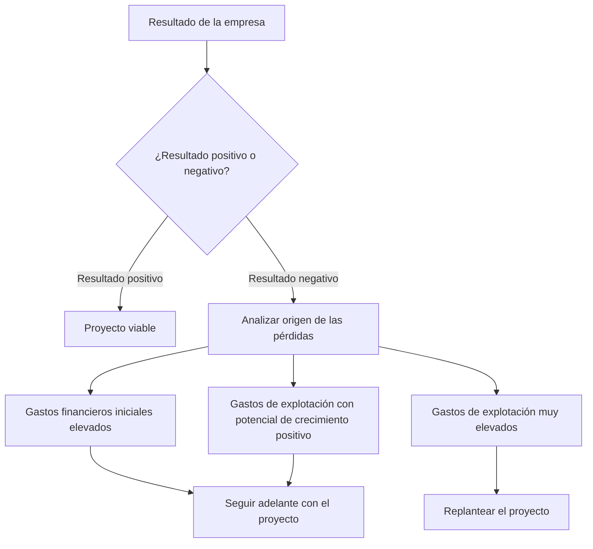
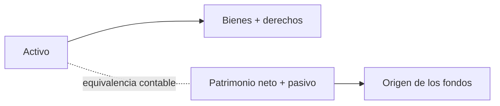
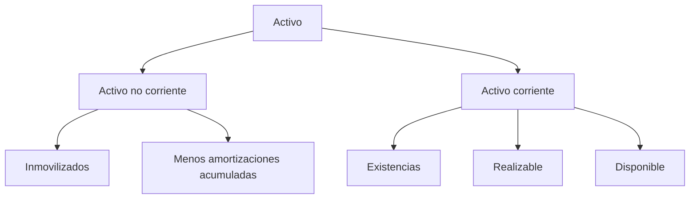
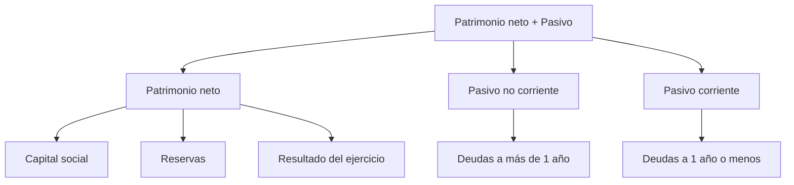
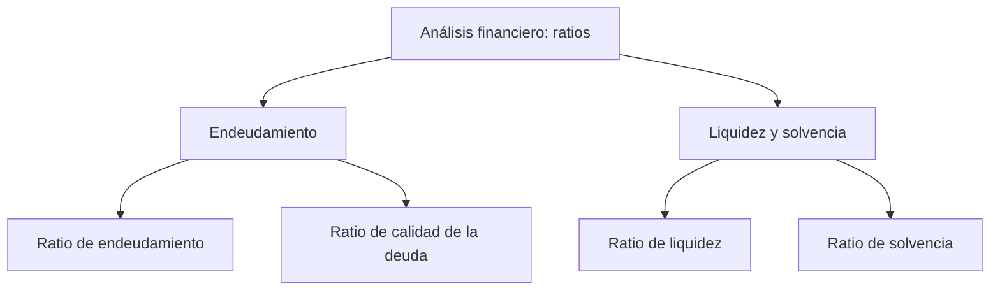
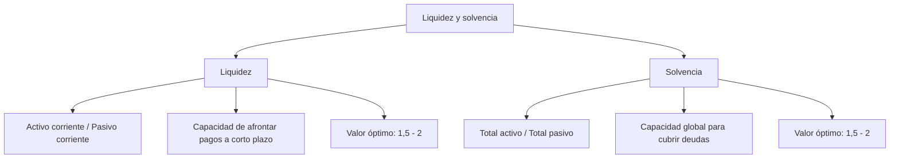

## Unidad 9: Viabilidad económico-financiera

> «Analizar tu propia realidad te guiará hacia decisiones más acertadas.»

## Índice

- [1. ¿Qué es un estudio de viabilidad económico-financiera?](#1-qué-es-un-estudio-de-viabilidad-económico-financiera)
- [2. Análisis económico: la Cuenta de Pérdidas y Ganancias](#2-análisis-económico-la-cuenta-de-pérdidas-y-ganancias)
  - [2.1. Composición y estructura](#21-composición-y-estructura)
  - [2.2. Interpretación de resultados](#22-interpretación-de-resultados)
- [3. Análisis financiero: el Balance de situación](#3-análisis-financiero-el-balance-de-situación)
  - [3.1. Composición y estructura](#31-composición-y-estructura)
  - [3.2. Interpretación del balance](#32-interpretación-del-balance)
- [Enlaces de interés](#enlaces-de-interés)

## 1. ¿Qué es un estudio de viabilidad económico-financiera?

El **análisis de viabilidad** es el estudio que determina el éxito o fracaso de un proyecto. Informa de hasta qué punto es viable llevarlo a cabo.

Es necesario realizar un doble análisis de viabilidad:

| Tipo de viabilidad | Descripción |
|---|---|
| **Viabilidad o rentabilidad económica** | Indica si el proyecto es capaz de generar suficientes beneficios para que compense la inversión realizada. |
| **Viabilidad o rentabilidad financiera** | Comprueba si existe dinero suficiente para hacer frente, en el día a día, a todos los pagos que se produzcan en la empresa. |



## 2. Análisis económico: la Cuenta de Pérdidas y Ganancias

La **Cuenta de Pérdidas y Ganancias** es un documento contable que refleja y explica el resultado que la empresa ha obtenido durante un ejercicio económico.



:::note[Idea clave]
La Cuenta de Pérdidas y Ganancias permite saber si la actividad de la empresa genera **beneficios** o **pérdidas** durante un periodo concreto.
:::

## 2.1. Composición y estructura

### Composición

La Cuenta de Pérdidas y Ganancias se compone principalmente de **ingresos** y **gastos**.

| Tipo | Concepto | Descripción |
|---|---|---|
| **Ingresos** | Ventas de mercaderías | Ingresos procedentes de la venta de los bienes que comercializa la empresa. |
| **Ingresos** | Prestación de servicios | Ingresos cuyo origen es la prestación de servicios por parte de la empresa. |
| **Ingresos** | Otros ingresos financieros | Ingresos procedentes de intereses de cuentas bancarias a favor de la empresa. |
| **Gastos** | Compra de mercaderías | Importe de la compra de los bienes que comercializa la empresa. |
| **Gastos** | Arrendamientos | Gastos de alquiler. |
| **Gastos** | Servicios de profesionales independientes | Gastos de asesoría, abogados, notaría, etc. |
| **Gastos** | Primas de seguros | Importe de los seguros contratados: incendio, robo, responsabilidad civil, etc. |
| **Gastos** | Servicios bancarios y similares | Gastos por comisiones bancarias. |
| **Gastos** | Publicidad | Gastos en anuncios publicitarios, folletos, etc. |
| **Gastos** | Suministros | Gastos de luz, agua, teléfono, internet, etc. |
| **Gastos** | Impuesto sobre Sociedades | Cantidad que se paga a la Agencia Tributaria por los beneficios obtenidos. |
| **Gastos** | Otros tributos | Importes satisfechos por otros impuestos distintos del Impuesto de Sociedades. |
| **Gastos** | Sueldos y salarios | Sueldos pagados a los trabajadores. |
| **Gastos** | Seguridad Social a cargo de la empresa | Cuotas satisfechas por la cotización de los trabajadores. |
| **Gastos** | Otros gastos financieros | Intereses bancarios a pagar por la empresa. |
| **Gastos** | Amortizaciones | Valoración contable de las pérdidas de valor que sufren los elementos del activo fijo. |

### Estructura

La estructura de la Cuenta de Pérdidas y Ganancias permite ordenar los resultados de la empresa.



| Apartado | Cálculo |
|---|---|
| **A) Resultado de explotación** | `+ Ingresos de explotación - Gastos de explotación` |
| **B) Resultado financiero** | `+ Ingresos financieros - Gastos financieros` |
| **C) Resultado antes de impuestos** | `A + B` |
| **D) Resultado del ejercicio** | `Resultado antes de impuestos - Impuesto de Sociedades` |

## 2.2. Interpretación de resultados

La interpretación del resultado permite decidir si el proyecto es viable o si debe replantearse.



:::tip[Interpretación práctica]
Un resultado negativo no siempre significa que el proyecto no sea viable. Hay que analizar el **origen de las pérdidas**.
:::

| Situación | Interpretación |
|---|---|
| **Resultado positivo** | El proyecto puede considerarse viable. |
| **Resultado negativo por gastos financieros iniciales elevados** | Puede ser razonable continuar si se espera una mejora posterior. |
| **Resultado negativo por gastos de explotación con potencial de crecimiento positivo** | Puede ser razonable continuar si el proyecto tiene margen de crecimiento. |
| **Resultado negativo por gastos de explotación muy elevados** | Conviene replantear el proyecto. |

## 3. Análisis financiero: el Balance de situación

El **Balance de situación** es un documento contable que refleja el patrimonio de la empresa debidamente valorado en un momento determinado.



La estructura básica del balance es:

```txt
Activo = Patrimonio neto + Pasivo
```

| Parte del balance | Significado |
|---|---|
| **Activo** | Representa la estructura económica de la empresa: en qué ha invertido y cómo ha aplicado los fondos. |
| **Patrimonio neto + Pasivo** | Representa la estructura financiera de la empresa: cómo se ha financiado y cuál es el origen de los fondos. |

## 3.1. Composición y estructura

### Activo

El **activo** recoge los bienes y derechos que posee una empresa. Se ordena de **menor a mayor liquidez**.

:::note[Liquidez]
La liquidez indica la facilidad con la que un elemento puede convertirse en dinero.
:::

| Tipo de activo | Descripción |
|---|---|
| **Activo no corriente** | Elementos vinculados a la empresa durante más de un ejercicio. Por ejemplo: maquinaria, edificios, etc. También se conocen como inmovilizados. Debe tenerse en cuenta su amortización acumulada. |
| **Activo corriente** | Elementos que se renuevan constantemente. Incluye existencias, realizable y disponible. |

#### Elementos del activo corriente

| Elemento | Descripción |
|---|---|
| **Existencias** | Materiales que se utilizan en la elaboración del producto o mercancías ya elaboradas que la empresa comercializa. |
| **Realizable** | Derechos de cobro de clientes por ventas realizadas a plazos. |
| **Disponible** | Cuentas corrientes y dinero en metálico que existe en las cajas de la empresa. |



### Patrimonio neto y pasivo

El **patrimonio neto y el pasivo** recogen la estructura financiera de la empresa, es decir, de dónde se han obtenido los fondos para poder realizar las inversiones que figuran en el activo.

Se ordenan de **menor a mayor exigibilidad**.

:::note[Exigibilidad]
La exigibilidad indica el plazo o la obligación de devolución de una fuente de financiación.
:::

| Elemento | Descripción |
|---|---|
| **Patrimonio neto** | Recursos financieros que no se tienen que devolver durante la vida de la empresa. |
| **Pasivo no corriente** | Deudas con plazo de devolución superior a un año. Por ejemplo: préstamo a 5 años. |
| **Pasivo corriente** | Deudas con plazo de devolución igual o inferior a un año. Por ejemplo: deuda con proveedores a 90 días. |

#### Elementos del patrimonio neto

| Elemento | Descripción |
|---|---|
| **Capital social** | Aportaciones de los socios en el momento de la constitución de la empresa. |
| **Reservas** | Beneficios no distribuidos de ejercicios anteriores. |
| **Resultado del ejercicio** | Pérdidas o ganancias obtenidas en el ejercicio actual. |



### Estructura del balance

| Activo | Patrimonio neto + pasivo |
|---|---|
| **A) Activo no corriente** | **A) Patrimonio neto** |
| I. Inmovilizados | I. Capital |
| Menos amortizaciones acumuladas | II. Reservas |
|  | III. Resultado del ejercicio |
| **B) Activo corriente** | **B) Pasivo no corriente** |
| I. Existencias | Deudas a más de 1 año |
| II. Realizable | **C) Pasivo corriente** |
| III. Disponible | Deudas a 1 año o menos |
| **Total activo** | **Total patrimonio neto + pasivo** |

## 3.2. Interpretación del balance

Un **ratio** es un cociente que relaciona elementos del balance y muestra si la proporción entre ellos es correcta.



### Apartado no evaluable: situación de endeudamiento

#### Endeudamiento

El **endeudamiento** mide el peso que tienen las deudas, es decir, el pasivo, sobre la financiación total de la empresa.

```txt
Endeudamiento = Total pasivo / (Patrimonio neto + pasivo)
```

Valor óptimo aproximado:

```txt
0,4 - 0,6
```

#### Calidad de la deuda

La **calidad de la deuda** mide el porcentaje de la deuda a corto plazo, es decir, el pasivo corriente, respecto al total de la deuda.

```txt
Calidad de la deuda = Pasivo corriente / Total pasivo
```

Cuanto más bajo sea su valor, mejor.

### Conceptos evaluables: liquidez y solvencia

#### Liquidez

La **liquidez** relaciona lo que la empresa tiene convertible en dinero en un plazo corto de tiempo, es decir, el **activo corriente**, con lo que debe en ese mismo corto plazo, es decir, el **pasivo corriente**.

También se conoce como **fondo de maniobra**.

```txt
Liquidez = Activo corriente / Pasivo corriente
```

Valor óptimo aproximado:

```txt
1,5 - 2
```

Si el valor se acerca a `1`, la empresa puede entrar en una situación de **suspensión de pagos**.

#### Solvencia

La **solvencia** relaciona lo que la empresa tiene, es decir, el **total activo**, con lo que la empresa debe, es decir, el **total pasivo**.

```txt
Solvencia = Total activo / Total pasivo
```

Valor óptimo aproximado:

```txt
1,5 - 2
```

Si el valor se acerca a `1`, la empresa puede entrar en una situación de **quiebra**.



### Apartado no evaluable: cuadro-resumen completo de ratios

| Ratio | Valor adecuado |
|---|---|
| **Endeudamiento** | Entre `0,4` y `0,6`. Un valor por encima de `0,6` implicaría un endeudamiento muy elevado que podría ser peligroso. |
| **Calidad de la deuda** | Cuanto menor sea su valor, mejor. Cuanto más se acerque a `1`, la deuda será de peor calidad. |
| **Liquidez** | Entre `1,5` y `2`. Si el valor se acerca a `1`, podemos entrar en situación de suspensión de pagos. |
| **Solvencia** | Entre `1,5` y `2`. Si el valor se acerca a `1`, podemos entrar en situación de quiebra. |

## Enlaces de interés

- [¿Qué es la cuenta de Pérdidas y Ganancias?](https://acortar.link/f0YEvh)
- [Cuenta de Pérdidas y Ganancias - recurso complementario](https://cutt.ly/3fvZAHL)
- [Vídeo explicativo sobre el Balance de Situación](https://acortar.link/J178fj)
- [Balance de Situación - recurso complementario](https://cutt.ly/WfvoLh8)
- [Los ratios financieros](https://acortar.link/1nezQq)
- [Ratios financieros - recurso complementario](https://cutt.ly/5fvZ6Mc)
- [Reto Plan de Empresa - Flexibook](https://www.flexibook.es/?p=10333)
