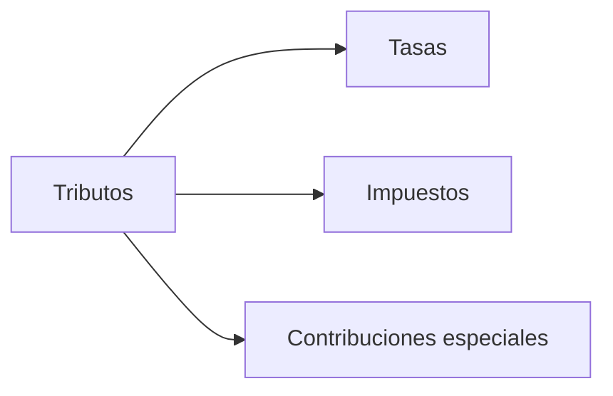
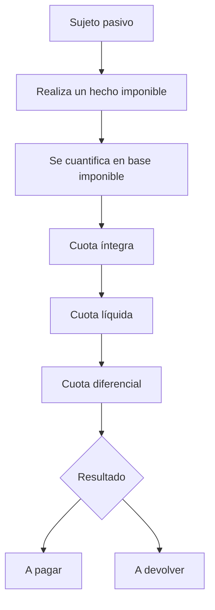
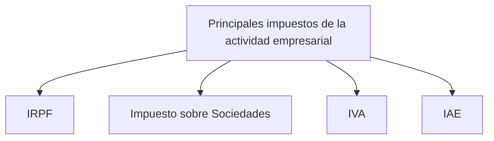
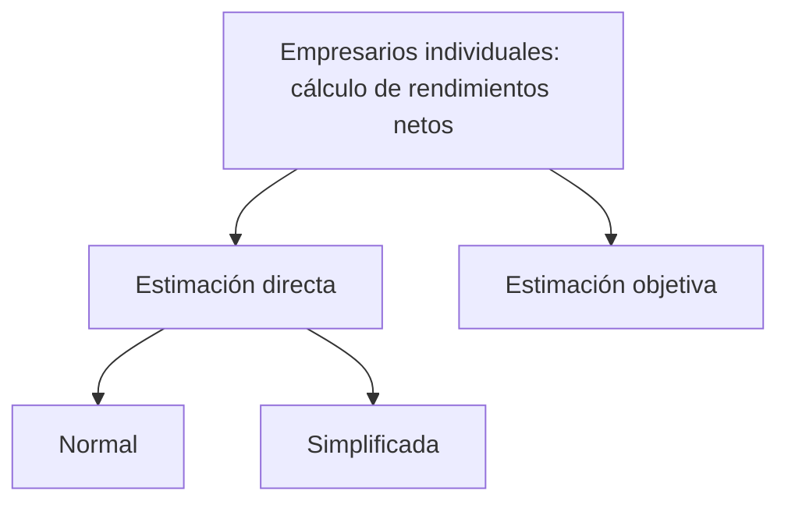
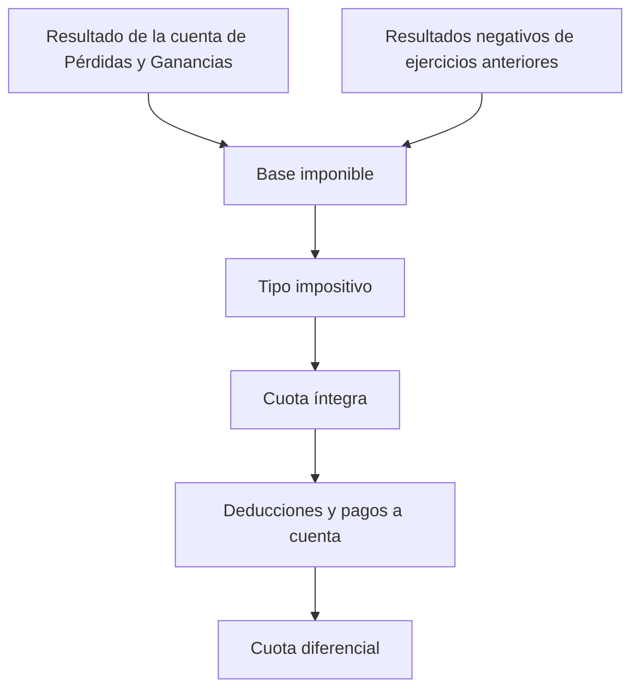
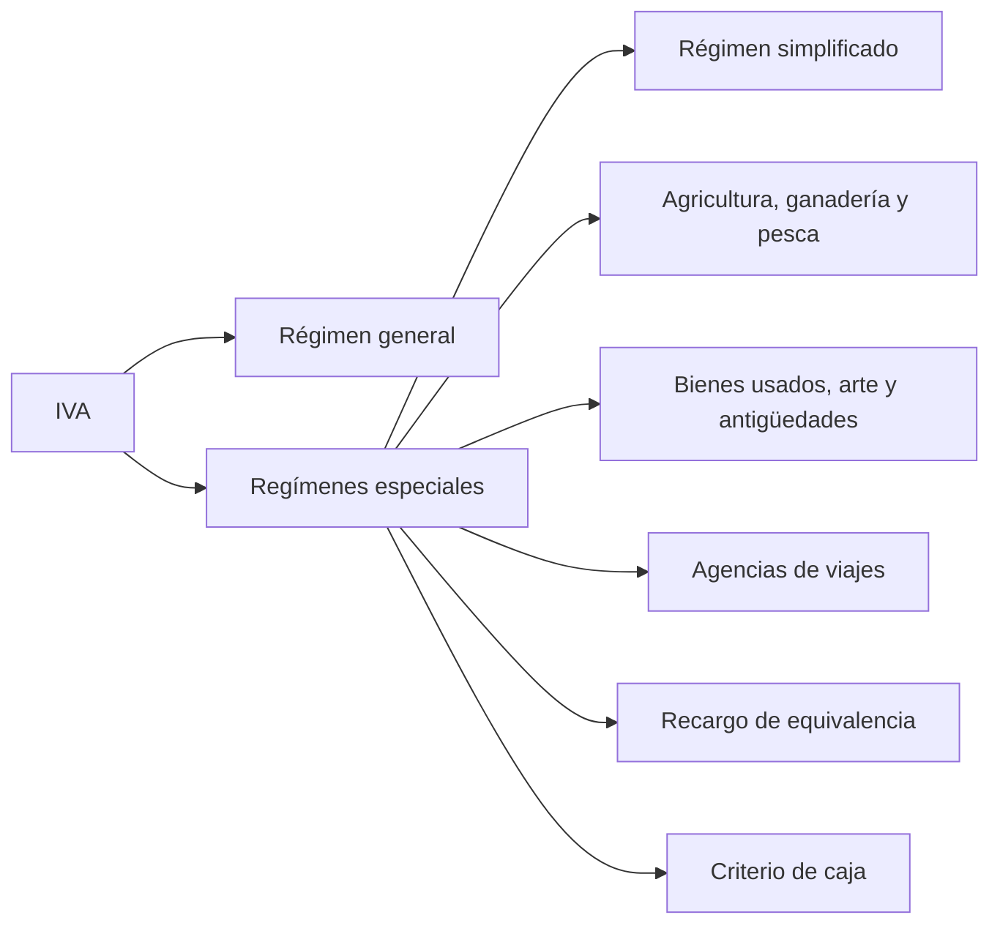
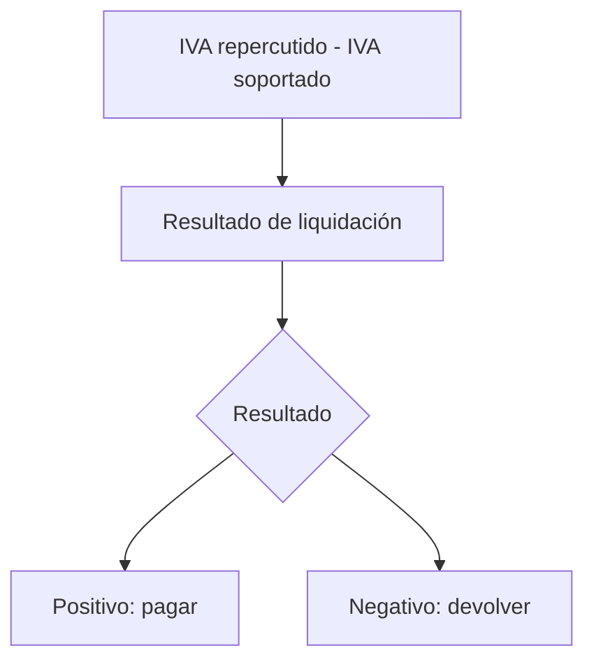

import BorderedSection from '../../../../components/bordered-section.astro';

## Unidad 10: La gestión fiscal de mi empresa

> «Lo único que duele más que tener que pagar un impuesto sobre ingresos es no tener ingresos sobre los que pagar un impuesto».  
> — Thomas Dewar

:::note[Evaluación]
En esta unidad hay varios apartados marcados como **no evaluables**. Se han colocado dentro del componente `BorderedSection`.

Sí entran dentro de los apartados indicados:

- Del **punto 1.2**, solo entra **tipo impositivo**.
- Del **punto 3**, solo entra **otros impuestos**.
:::

## 1. Conceptos generales de fiscalidad

Los **tributos** son ingresos públicos de carácter obligatorio que tanto ciudadanos como empresas deben pagar para financiar el gasto público.

### 1.1. Los tributos: finalidad y clasificación

| Tributo | Definición | Ejemplo |
|---|---|---|
| **Tasas** | Tributos que se pagan como contrapartida a la prestación de un servicio público o a la realización de una actividad. | Tasas de matrícula de un instituto o universidad pública. |
| **Impuestos** | Tributos exigidos por la Administración Pública sin una contraprestación directa para quien los paga. Suponen la mayor parte de la recaudación fiscal. | Impuesto por la obtención de beneficios de una empresa o por la adquisición de un producto. |
| **Contribuciones especiales** | Tributos aplicados a propietarios de bienes cuyo valor aumenta como consecuencia de una obra pública. | Pavimentación de una calle. |

#### Tipos de impuestos

| Tipo | Definición | Ejemplos |
|---|---|---|
| **Directos** | Gravan la renta o la riqueza de personas y empresas teniendo en cuenta sus circunstancias económicas y familiares. | IRPF e Impuesto sobre Sociedades. |
| **Indirectos** | Gravan hechos concretos, como comprar un producto, sin tener en cuenta las circunstancias personales de quien lo realiza. | IVA. |

:::tip[Enlaces]
- [Los tributos y Presupuestos Generales del Estado](https://acortar.link/8xIWPj)
- [Vídeo complementario](https://cutt.ly/UWsXaPz)
:::

### 1.2. Elementos básicos de un tributo

<BorderedSection>

#### Contenido no evaluable del punto 1.2

Los siguientes elementos forman parte del apartado 1.2, pero **no son evaluables**.

| Elemento | Definición | Ejemplo |
|---|---|---|
| **Hecho imponible** | Acción que da lugar al nacimiento de la obligación tributaria. | Si una sociedad obtiene beneficios, está obligada a pagar el Impuesto sobre Sociedades. |
| **Sujeto pasivo** | Persona o empresa obligada a liquidar el tributo. Puede coincidir o no con quien realmente lo paga. | Una empresa retiene IRPF a sus trabajadores y lo ingresa en Hacienda. El trabajador es el contribuyente. |
| **Período impositivo** | Plazo de tiempo que se corresponde con la liquidación del impuesto. | En IRPF o IS coincide con el año natural: del 1 de enero al 31 de diciembre. |
| **Base imponible** | Cuantificación del hecho imponible. | Si los beneficios ascienden a 15.000 €, esa sería la base imponible. |
| **Cuota íntegra** | Resultado de multiplicar la base imponible por el tipo impositivo. | Si el tipo de IS es del 20 % y los beneficios son 15.000 €, la cuota íntegra será 3.000 €. |
| **Cuota líquida** | Deuda tributaria una vez descontadas posibles deducciones o bonificaciones. | Deducciones en IS por contratación de trabajadores discapacitados. |
| **Pagos a cuenta** | Pagos realizados por adelantado a Hacienda a cuenta de la cuantía total anual. | En IRPF suelen ser trimestrales; en IS se pagan en abril, octubre y diciembre. |
| **Cuota diferencial** | Cantidad pendiente de pagar o devolver tras restar los pagos a cuenta. | Si la cuota íntegra es 3.000 € y se han pagado 1.200 €, quedan 1.800 €. |

</BorderedSection>

#### Tipo impositivo

El **tipo impositivo** es un porcentaje que se aplica sobre la base imponible para calcular la cuota a pagar.

Hay dos tipos principales:

| Tipo impositivo | Definición | Ejemplo |
|---|---|---|
| **Progresivo** | Aumenta conforme se incrementa la base imponible. | IRPF. |
| **Proporcional** | Se aplica siempre el mismo porcentaje, independientemente de la base imponible. | IVA. |

En el **IRPF**, los tipos impositivos aumentan conforme aumenta la base imponible. Por tanto, las personas con mayor renta pagan más impuestos.

En el **Impuesto sobre Sociedades**, el tipo impositivo es proporcional, aunque depende de determinadas circunstancias. El tipo general es del **25 %**, aunque pueden aplicarse tipos inferiores en algunos casos.

## 2. Principales impuestos que pagan las empresas

Los principales impuestos relacionados con la actividad empresarial son:

<BorderedSection>

### 2.1. Impuesto sobre la Renta de las Personas Físicas \(IRPF\)

> Apartado **no evaluable**.

El **IRPF** es un tributo directo y progresivo que grava la renta de las personas físicas en función de su cuantía y de sus circunstancias personales y familiares.

Las rentas que grava son:

- Rendimientos del trabajo: sueldos, pensiones, etc.
- Rendimientos del capital mobiliario: intereses bancarios, dividendos de acciones, etc.
- Rendimientos del capital inmobiliario: rentas por alquiler de inmuebles.
- Rendimientos de actividades económicas: beneficios obtenidos por empresarios individuales.
- Ganancias y pérdidas patrimoniales: por la venta de bienes.

#### Rendimientos de actividades económicas

Los rendimientos de actividades económicas proceden del trabajo personal y/o del capital debido a la ordenación por cuenta propia de recursos materiales y humanos con el objetivo de producir o distribuir bienes y/o servicios.

#### Métodos de cálculo de rendimientos netos

| Método | ¿A quién se aplica? | ¿Cómo se calculan los rendimientos netos? |
|---|---|---|
| **Estimación directa normal \(EDN\)** | Cuando la cifra de ventas del año anterior supera los 600.000 €, si se ha renunciado a la estimación directa simplificada o si no se está acogido a la estimación objetiva. | En general, por la diferencia entre ingresos y gastos. |
| **Estimación directa simplificada \(EDS\)** | Cuando la cifra de ventas del año anterior es inferior a 600.000 € y no se está acogido a la estimación objetiva. | Igual que en estimación directa normal, pero las provisiones deducibles y gastos de difícil justificación se cuantifican aplicando un 5 % del rendimiento neto, con límite de 2.000 €/año. |
| **Estimación objetiva \(EO\)** | Cuando la cifra de ventas del año anterior es inferior a 125.000 €, o 250.000 € en actividades agrícolas, ganaderas o forestales, y la actividad está incluida en la orden correspondiente. | Mediante módulos indicativos del volumen de negocio. No se calcula teniendo en cuenta ingresos y gastos reales. |

#### Resumen del IRPF

| Elemento | Contenido |
|---|---|
| **Hecho imponible** | Obtención de rentas por parte del sujeto pasivo. |
| **Sujeto pasivo** | Empresarios individuales, profesionales y personas físicas miembros de entidades en régimen de atribución de rentas. |
| **Período impositivo** | Año natural: del 1 de enero al 31 de diciembre. |
| **Base imponible** | Suma de todas las rentas obtenidas. En empresarios, las rentas de la actividad económica calculadas según el régimen aplicable. |
| **Tipo impositivo** | Progresivo en función de la base imponible. |
| **Deducciones** | Inversiones o gastos de interés cultural, donativos, incentivos a la inversión empresarial, etc. |
| **Pagos fraccionados** | En estimación directa, el 20 % del rendimiento neto. En estimación objetiva, el 4 % del rendimiento neto por módulos. |
| **Modelos oficiales** | Modelo 130, modelo 131 y modelo 100. |
| **Plazo de presentación** | Pagos fraccionados: abril, julio, octubre y enero. Declaración anual: desde abril hasta el 30 de junio del año siguiente. |

:::tip[Enlaces]
- [IRPF](https://acortar.link/XRqd2D)
- [Acceso al servicio Renta Web](https://cutt.ly/9X3oHUD)
- [Cálculo tipo IRPF 2025](https://acortar.link/SalSl7)
:::

</BorderedSection>

### 2.2. Impuesto sobre Sociedades \(IS\)

El **Impuesto sobre Sociedades** es un impuesto directo que grava los rendimientos o beneficios obtenidos por las sociedades españolas.

#### Elementos característicos del Impuesto sobre Sociedades

| Elemento | Contenido |
|---|---|
| **Hecho imponible** | Obtención de beneficios por parte de las sociedades en territorio español. |
| **Sujeto pasivo** | Empresas. También se incluyen las sociedades civiles con objeto mercantil según la Ley 27/2014 del Impuesto sobre Sociedades. |
| **Período impositivo** | Año natural: del 1 de enero al 31 de diciembre. |
| **Base imponible** | Resultado de aplicar al resultado contable de la cuenta de pérdidas y ganancias las correcciones necesarias cuando existan diferencias entre normativa contable y fiscal. |
| **Tipo impositivo** | Tipo general del 25 %. También existen tipos especiales. |
| **Deducciones** | Incentivos fiscales para I+D+i, creación de empleo y contratación de trabajadores discapacitados. |
| **Pagos fraccionados** | Con carácter general, 18 % sobre la cuota íntegra resultante del año anterior. |
| **Modelos oficiales** | Modelo 202 para pagos fraccionados y modelo 200 para declaración anual. |
| **Plazo de presentación** | Pagos fraccionados: del 1 al 20 de abril, octubre y diciembre. Declaración anual: del 1 al 25 de julio del año siguiente. |

#### Tipos impositivos del IS

| Tipo | Porcentaje |
|---|---:|
| Tipo general | 25 % |
| Entidades de nueva creación durante el primer y segundo año de base imponible positiva | 15 % |
| Entidades de crédito | 30 % |
| Sociedades cooperativas fiscalmente protegidas | 20 % |
| Fondos de inversión | 1 % |
| Fondos de pensiones | 20 % |

:::tip[Enlace]
- [Impuesto sobre Sociedades](https://acortar.link/LHD4qn)
:::

### 2.3. Impuesto sobre el Valor Añadido \(IVA\)

El **IVA** es un impuesto indirecto que grava el consumo de bienes y servicios y recae sobre el consumidor final.

Los empresarios actúan como recaudadores: ingresan a la Agencia Tributaria el impuesto que cobran a sus clientes en sus facturas.

#### A. Régimen general

El esquema general de liquidación del IVA es:

| Resultado | Interpretación |
|---|---|
| **Positivo = pagar** | Se ha cobrado más IVA del que se ha pagado. Hay que ingresar la diferencia. |
| **Negativo = devolver** | Se ha cobrado menos IVA del que se ha pagado. Hacienda devuelve la diferencia. |

#### Elementos característicos del IVA

| Elemento | Contenido |
|---|---|
| **Hecho imponible** | Entregas de bienes y prestaciones de servicios. |
| **Sujeto pasivo** | Personas físicas o jurídicas que vendan o presten servicios. Aunque el impuesto recae sobre el consumidor final. |
| **Base imponible** | Importe del bien o servicio prestado. |
| **Tipo impositivo** | Varía según el tipo de producto o servicio. |
| **Operaciones exentas** | Operaciones que se compran con IVA, pero se venden sin IVA, como algunos servicios médicos, enseñanza, seguros y operaciones financieras. |
| **Modelos oficiales** | Modelo 303 para pagos trimestrales, modelo 310 por módulos y modelo 390 para declaración anual. |
| **Plazo de presentación** | Pagos trimestrales del 1 al 20 de abril, julio y octubre. Último período del 1 al 30 de enero. Declaración anual del 1 al 30 de enero. |

#### Tipos impositivos del IVA

| Tipo | Porcentaje | Ejemplos |
|---|---:|---|
| **General** | 21 % | Electrodomésticos, juguetes, muebles, textil, informática, gasóleo, etc. |
| **Reducido** | 10 % | Transporte de viajeros, vivienda, hostelería, etc. |
| **Superreducido** | 4 % | Alimentos básicos, medicamentos, libros, periódicos y revistas, etc. |

:::tip[Enlace]
- [Vídeo sobre el IVA](https://www.youtube.com/watch?v=4ZXc4cmOlNM)
:::

<BorderedSection>

#### B. Régimen especial de recargo de equivalencia \(RE\)

> Apartado **no evaluable**.

El **recargo de equivalencia** es un régimen especial de IVA obligatorio para comerciantes minoristas que venden directamente al consumidor final sin transformar los productos.

| IVA | Recargo de equivalencia \(RE\) |
|---|---:|
| General 21 % | 5,2 % |
| Reducido 10 % | 1,4 % |
| Superreducido 4 % | 0,5 % |
| Tabaco | 1,75 % |

:::tip[Enlaces]
- [Recargo de equivalencia](https://acortar.link/DA4EhN)
- [Información complementaria](https://acortar.link/ROp7a8)
:::

</BorderedSection>

<BorderedSection>

### 2.4. Impuesto sobre Actividades Económicas \(IAE\)

> Apartado **no evaluable**.

El **IAE** es un tributo municipal que grava el mero ejercicio de actividades económicas en territorio nacional.

#### Sujetos pasivos

- Personas físicas \(autónomos\).
- Personas jurídicas \(sociedades\).
- Entidades sin personalidad jurídica, como sociedades civiles y comunidades de bienes.

#### Exenciones

Están exentas:

- Personas físicas.
- Sociedades y entidades con importe neto de cifra de negocios inferior a **1.000.000 €**.

A pesar de la exención, existe obligación de alta en el IAE mediante declaración censal, usando el **modelo 036** o el **modelo 037**.

</BorderedSection>

## 3. Otras obligaciones fiscales

<BorderedSection>

### Contenido no evaluable del punto 3

El siguiente contenido del punto 3 **no es evaluable**.

#### Retenciones de IRPF a los trabajadores

Los empresarios tienen la obligación de descontar de las nóminas de sus trabajadores una cantidad en concepto de retención a cuenta del pago del IRPF.

Para calcular la retención, las empresas solicitan a los trabajadores el **modelo 145**, donde constan sus circunstancias personales y familiares.

El importe retenido se ingresa mediante el **modelo 111**, entre el 1 y el 20 de abril, julio, octubre y enero.

Posteriormente, del 1 al 31 de enero del año siguiente, se presenta el resumen anual de retenciones mediante el **modelo 190**.

#### Declaración anual de operaciones con terceros

Los empresarios y profesionales que desarrollen actividades económicas deben presentar el **modelo 347**, donde se relacionan las personas, sociedades o entidades con las que se han realizado operaciones que superen los **3.005,06 €** \(IVA incluido\).

:::tip[Enlace]
- [Servicio de cálculo de retenciones IRPF 2025](https://acortar.link/SalSl7)
:::

</BorderedSection>

### Otros impuestos

Los **otros impuestos** son, en su mayoría, impuestos de carácter local. Para conocer importes, plazos y detalles concretos hay que consultar al municipio correspondiente.

| Impuesto | Definición |
|---|---|
| **Impuesto sobre Bienes Inmuebles \(IBI\)** | Se paga por ser titular de un inmueble: piso, local, nave, almacén, etc. La cantidad se calcula aplicando un porcentaje sobre el valor catastral del inmueble. |
| **Impuesto sobre Vehículos de Tracción Mecánica \(IVTM\)** | Se paga por ser titular de un vehículo: moto, coche, furgoneta, etc. La cantidad depende de la potencia fiscal, número de plazas, peso de la carga o cilindrada. |
| **Impuesto sobre Construcciones, Instalaciones y Obras** | Se paga por realizar una obra, instalación o construcción que requiera licencia de obras. La cuantía depende del coste de la obra. |
| **Impuesto de Transmisiones Patrimoniales y Actos Jurídicos Documentados \(ITP y AJD\)** | Grava transmisiones patrimoniales, operaciones societarias y actos jurídicos formalizados mediante documentos notariales, mercantiles o administrativos. |

## 4. Calendario fiscal

<BorderedSection>

> Apartado **no evaluable**.

El calendario fiscal recoge los principales plazos de presentación de obligaciones tributarias.

| Mes | Obligación fiscal | Modelo |
|---|---|---|
| **Enero** | IRPF. Retenciones 4.º trimestre del ejercicio anterior. | 111 |
| **Enero** | IRPF. Pagos fraccionados 4.º trimestre del ejercicio anterior. | 130 / 131 |
| **Enero** | IVA. Autoliquidación 4.º trimestre del ejercicio anterior. | 303 |
| **Enero** | IVA. Resumen anual del ejercicio anterior. | 390 |
| **Enero** | IRPF. Resumen anual retenciones del ejercicio anterior. | 190 |
| **Febrero** | Declaración anual de operaciones con terceros del ejercicio anterior. | 347 |
| **Abril** | Apertura plazo de presentación IRPF. | D-100 |
| **Abril** | IRPF. Retenciones 1.er trimestre del año actual. | 111 |
| **Abril** | IRPF. Pagos fraccionados 1.er trimestre del año actual. | 130 / 131 |
| **Abril** | IS. Primer pago fraccionado del año actual. | 202 |
| **Abril** | IVA. Autoliquidación 1.er trimestre del año actual. | 303 |
| **Junio** | Finalización plazo presentación IRPF con resultado a ingresar. | D-100 |
| **Julio** | Finalización plazo presentación IRPF con resultado a devolver. | D-100 |
| **Julio** | IRPF. Retenciones 2.º trimestre del ejercicio actual. | 111 |
| **Julio** | IRPF. Pagos fraccionados 2.º trimestre del ejercicio actual. | 130 / 131 |
| **Julio** | IVA. Autoliquidación 2.º trimestre del ejercicio actual. | 303 |
| **Julio** | IS. Declaración anual del ejercicio anterior. | 200 |
| **Octubre** | IRPF. Retenciones 3.er trimestre del ejercicio actual. | 111 |
| **Octubre** | IRPF. Pagos fraccionados 3.er trimestre del ejercicio actual. | 130 / 131 |
| **Octubre** | IS. Segundo pago fraccionado del ejercicio actual. | 202 |
| **Octubre** | IVA. Autoliquidación 3.er trimestre del ejercicio actual. | 303 |
| **Diciembre** | IS. Tercer pago fraccionado del ejercicio actual. | 202 |

</BorderedSection>
